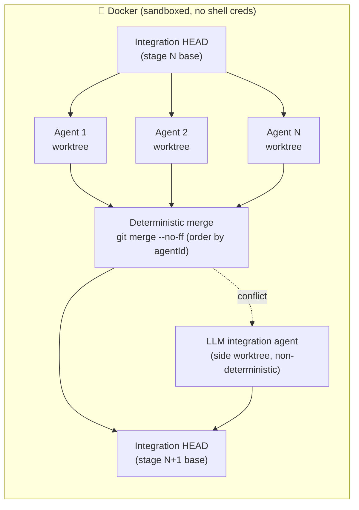
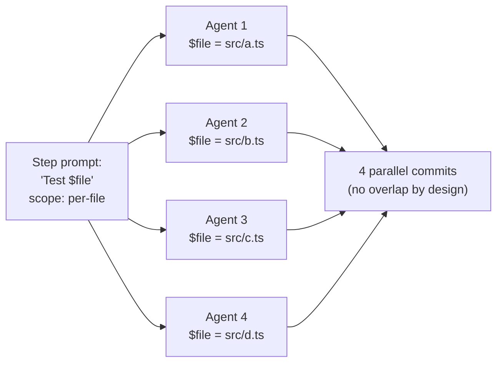
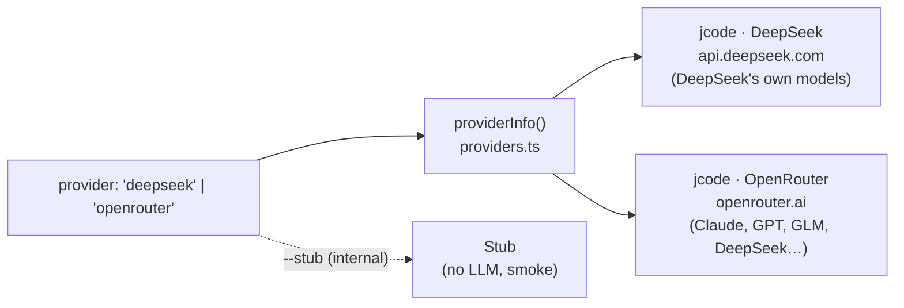

<p align="center">
  
</p>

<p align="center">
  <em>55 minutes of <code>huu</code> generating a unit-test suite — sped up to 10 seconds.
  A real example run (100% <strong>line</strong> coverage on this one), <strong>not</strong> a guaranteed
  outcome — see the coverage caveat in the <a href="#showcase-huu-test-suite">showcase</a>.</em>
</p>

<h1 align="center">huu</h1>

<p align="center">
  <strong><code>huu</code> — <em>Humans Underwrite Undertakings</em>.</strong>
</p>

<p align="center">
  <em>The agent orchestrator where the <strong>method is yours</strong> and the <strong>intelligence is the model's</strong>.</em>
</p>

<p align="center">
  A JSON pipeline becomes parallel agents — <strong>one per file</strong> — in isolated git worktrees,
  merged at every stage <strong>deterministically in method and merge order</strong>
  (<a href="MANIFESTO.en.md">not in result</a>), with your credentials sandboxed in Docker.
</p>

<p align="center">
  <a href="MANIFESTO.en.md">Manifesto</a> · <strong>English</strong> · <a href="README.md">Português (BR)</a>
</p>

<p align="center">
  <a href="https://www.npmjs.com/package/huu-pipe"></a>
  <a href="#license"></a>
  <a href="https://www.repostatus.org/#active"></a>
  
  
  
  <a href="docs/README.md"></a>
</p>

<p align="center">
  <sub>Young project, essentially single-author, with heavily AI-assisted development —
  read <a href="#status--maturity">Status &amp; maturity</a> before taking it to critical production.</sub>
</p>

---

## The four orchestration primitives

| | Primitive | What it does |
|---|---|---|
| 🗺️ | **Map** — `per-file`/`memory` fan-out | the same prompt becomes N parallel agents, one per file (`$file` + `$hint`), each in its own git worktree |
| 🔀 | **Switch** — check steps | an LLM judge with shell access emits a JSON verdict and the cursor follows the outcome (safe `default` + `maxRuns`) |
| ◇ | **Parallel + Join** — [`dependsOn`](docs/pipeline-json-guide.md) | heterogeneous branches run together in **deterministic waves**; the **order** of the waves and merges is the same on every run (the *content* of each node is the model's — and a conflicting merge falls to an LLM resolver) |
| 🧠 | **Memory** — [`produces` → `filesFrom`](docs/memory-scope.md) | one step **discovers** the work and the next fans out over it — zero human file-picking; huu injects the format contract |

They compose freely: *discover → memory fan-out → parallel branches →
judged join → cascading rework* — all visible on the kanban, all
reproducible **in topology**. Something broke? Every fatal error ships
with **cause + next step** ([troubleshooting](docs/troubleshooting.md)).

## What huu is

**huu designs pipelines that make thinking agents follow a
deterministic process.** It is not a tool for building new features:
the focus is audits, test generation, and knowledge extraction — the
method is fixed and the agent brings the intelligence, not the scope.

**A pipeline is a file of orders that the AI obeys.** You write a
`huu-pipeline-v1.json` listing the steps and the files each step
touches. The orchestrator turns each step into a fan-out of parallel
agents — one agent per file when you ask for it — runs them in
isolated git worktrees, and merges them back into a single integration
branch **between every stage**. The whole run is sandboxed in Docker
so the agent never sees your shell credentials.

That sentence has a few claims worth unpacking:

- **The human underwrites the scope.** No LLM planner decides what
  step 3 should do or which files it should touch. If a step is
  misdesigned, the result is predictably and auditably wrong — not
  surprisingly wrong.
- **Deterministic in method and merge order, not in result.** The
  pipeline topology, the scopes, the merge points and the order
  (`git merge --no-ff`, branches ascending by agentId) are identical on
  every run. What the model writes *inside* each node is free — and when
  a merge conflicts, resolution falls to an **LLM integration agent**
  (non-deterministic, by construction). Two runs of the same pipeline
  produce different diffs; that's where the model's creativity earns its
  cost. The [MANIFESTO](MANIFESTO.en.md) develops this thesis.
- **In `per-file` mode, one agent gets one file.** The prompt is
  identical across the N agents — only `$file` is substituted. No
  context degradation between agents, no scope drift. Every agent is a
  fresh `jcode` subprocess (the default backend), running stateless —
  zero embeddings, no memory across turns: the whole context goes to
  its single mission.
- **Pipelines are portable, not provider-locked.** A
  `huu-pipeline-v1.json` is a versioned artifact — commit it, share
  it as a gist, contribute it to the cookbook. The know-how of *how
  to decompose this class of task* lives in plain JSON.

---

## Who huu is for (and what it is NOT)

Decide in 30 seconds whether this is for you:

- ✅ **It fits** if your method fits an ordered list of steps and the
  value is in running it with **discipline and reproducibility over N
  files**: audits, test generation, knowledge extraction, mechanical
  mass migration. You write the scope once; 30 agents obey in parallel.
- ❌ **It doesn't fit** for "fix this bug" or "build this feature."
  Open-ended, one-off work with no repeatable method calls for an
  interactive agent (Claude Code, Cursor) or an autonomous one
  (OpenHands). Writing a pipeline for that is overhead — and "build app
  X" is not a pipeline, it's a bet.

The rule of thumb: **when every step demands an open-ended design
decision, it's not huu's job. When the method is known and only rigorous
execution is left, it's exactly huu's job.**

---

## Quick start

**Prerequisites:** Node.js ≥ 20, `git`, and Docker (required) — **a stock
Docker is enough; the `buildx` plugin is NOT required**. The `Dockerfile`
carries no BuildKit-only syntax (no cache mounts, no `COPY --link`, no
heredocs), so the classic builder builds the whole image; put one back and
`scripts/check-dockerfile.ts` fails the gate. Export the key
of the **provider** you'll run: `DEEPSEEK_API_KEY`
([platform.deepseek.com](https://platform.deepseek.com)) by default, or
`OPENROUTER_API_KEY` ([openrouter.ai/keys](https://openrouter.ai/keys)) when
you run with `--provider=openrouter`.

### Docker

```bash
git clone https://github.com/frederico-kluser/huu
cd huu
docker build -t huu:local .
export DEEPSEEK_API_KEY=sk-...          # or OPENROUTER_API_KEY=sk-or-... with --provider=openrouter
HUU_IMAGE=huu:local huu run pipelines/huu-test-suite.pipeline.json
```

> Developing in the repo? `npm start` (and `npm run dev:docker`) **rebuild the
> `huu:local` image automatically** before running (`scripts/ensure-image.sh`,
> layer-cached — ~2s with no changes), so the container always executes the
> current source. Setting `HUU_IMAGE=<other>` skips the rebuild (a deliberate
> pin). `npm run dev` instead runs **natively, with no Docker at all**
> (`HUU_DEV_NATIVE=1`) for an instant edit loop — no container isolation and
> no container memory ceiling, so it is a contributor shortcut, not a way to
> use huu.

> Open **http://localhost:4888** in your browser — the **web UI is the
> default**. Inside Docker the server runs in the container and the port
> is published to the host automatically. Prefer the terminal? `huu --cli`.

> huu writes the bundled default pipelines into `./pipelines/` on first
> launch — pick one in the UI or pass its path.

Pre-built images at `ghcr.io/frederico-kluser/huu:latest` — the wrapper
pulls automatically when no `HUU_IMAGE` is set. VPN-aware MTU, secret
mounting, signal forwarding, and orphan cleanup are all handled by
the wrapper.

### Via npm

```bash
npm install -g huu-pipe        # Node 20+, `git`, and Docker
huu                            # re-execs itself into the container
```

huu is **docker-only**: every run executes in the container, which
carries the kernel memory ceiling (`--memory`); there is no native
mode. The old `--yolo` / `--no-docker` / `HUU_NO_DOCKER=1` bypasses
were **removed** — if present, huu prints a one-line notice, ignores
them and re-execs into Docker anyway. Only `--help` and the host
utilities (`init-docker`, `status`, `prune`) run outside the container.
Full install matrix (macOS / Windows / Linux, OrbStack notes, WSL2
caveats): [`docs/onboarding.md#install`](docs/onboarding.md#install).

The UI (web by default, or the TUI with `--cli`) opens on a dashboard:
start from `huu Test Suite` (the default pipeline, already materialized)
or build your own **without hand-writing JSON** — see the next section.

---

## Web UI (default)

Running `huu` opens a **browser interface** — Apple-inspired (Liquid
Glass, light/dark), real-time, no delay. It drives the same Orchestrator
as the TUI; only the face changes. The **`--cli`** flag brings the
terminal TUI back.

- **Default, no friction.** `huu` → web. `huu --cli` → terminal. The
  front-end (web/CLI) is orthogonal to the runtime — which is **always
  the container** (huu is docker-only).
- **Always in Docker.** The server runs inside the container and the
  port is published to the host (`-p`) automatically.
- **On your network.** Binds `0.0.0.0` by default — reach it from your
  phone or another machine at `http://<your-machine-ip>:4888`. Real-time
  over Server-Sent Events (auto-reconnecting), zero new dependencies
  (just `node:http`).
- **Close the tab, the run keeps going.** `huu` opens on the **home** screen,
  or jumps straight to the live **kanban** when a pipeline is already running.
  The run lives in the huu process, not the browser — close the tab and reopen
  any time to re-sync; only the **Stop** button or quitting `huu` (Ctrl+C) ends
  a run. Real-time has a **liveness watchdog**: a real `event: ping` heartbeat
  + stale-stream detection (60s) **auto-reconnect** a zombie SSE with no
  refresh from you — and the **queue survives a reload**: it persists status +
  `runId` and **re-links** to the live runs instead of resetting everything to
  "pending".
- **Everything is clickable — and green doesn't lie.** A kanban of cards
  (agents, merges, judges) flowing TODO → DOING → DONE — when a card changes
  column it **glides to the first slot of the new one** (GPU-composited,
  `transform`-only, jank-free), and each column **scrolls** once it fills up
  instead of squashing the cards flat. **Green `DONE` now means MERGED:** a
  card only turns green once the agent's branch actually lands in the
  integration worktree (per-branch, ascending — a visible ripple during the
  stage merge). Until then a finished task shows as a blue **`READY`** card
  still in DOING; if integration fails (or the run ends) without the branch
  landing, it becomes an amber **`UNMERGED`** card — the work is committed on
  the agent branch, it just never merged — instead of a false green. And a
  **`PAUSED`** card (memory guard) sits in the **TODO** column, because the
  task was literally re-queued. Click a card for **per-agent tokens, cost,
  branch, files and live logs**. Global log console, concurrency control
  (Auto · Manual) and a stop button up top.
- **Errors are signalled, and cards retry.** A card that **hit its time limit**
  shows in **amber** (`timeout`), distinct from the **red** of any other failure
  (`failed`). When a run ends with error cards, huu **doesn't jump straight to
  the summary**: it pauses in a **review** state (keeping the integration
  worktree alive) so you can recover failures one at a time. Click the red/amber
  card and hit **Retry** — a timeout additionally offers a **new, longer time
  limit**; any other error just re-runs. The card re-runs against the current
  integration HEAD and, on success, its branch is merged in — no need to re-run
  the whole pipeline. A **Finish** button leaves the review hold. (In the TUI:
  `R` retries the focused card, `D` finishes — on the single-run dashboard and,
  per run, on the multi-run one.)
- **Max time per agent — global and per pipeline.** A **Settings** panel (⚙ in the
  topbar) holds a global **Max time per agent** (minutes) that caps **every
  agent's** run time across the whole pipeline for **every run started from this
  browser**; the **per-pipeline** launch field **overrides** it (blank inherits the
  global). Blank everywhere keeps the pipeline's default (10 min · 5 min for
  single-file tasks). The global and per-pipeline values persist in the browser and
  are recorded in History. **Web UI only — the CLI keeps its own rules.**
  (Previously the web could only raise the limit when *retrying* an
  already-timed-out card; setting it up front was TUI-only.)
- **Guided launch (pipeline → projects → queue) — in parallel, with smart
  admission.** Build the queue in steps: **pick a pipeline** → **mark one or more
  projects** by browsing the filesystem (every folder has a **checkbox** — mark as
  many as you like, or **“☑ Mark all”** to mark every sub-folder of the current
  directory at once; marks persist as you navigate) → **configure that pipeline**
  (provider, model, concurrency, time — **shared by all its marked projects**) and
  it **fans out into one run per project** in the queue. Then **add another
  pipeline** (with its own projects and config) or **run the queue**. The queue
  shows everything **grouped by pipeline**. It all runs in parallel under one
  shared machine-wide **RAM/concurrency budget**: the server admits the first
  **right away** and holds the rest **`queued`**, pulling each in only when there
  is **sustained** spare memory — i.e. it does **not** fire the whole machine at
  once (exactly what crashed the process with many projects). Earlier projects
  have priority; later ones **backfill** idle slots (e.g. while one is merging),
  and under memory pressure the lowest-priority project's newest agent is
  **paused** first (its work preserved and resumed when headroom returns;
  `HUU_NO_PAUSE=1` reverts to killing). Running the **same pipeline over many
  projects** — or **many projects on the same repo** — is safe: each run isolates
  its worktrees/branches by `runId`. **How much RAM huu may use is a dial**
  (Settings → **RAM budget %**, or `HUU_RAM_PERCENT` / `--ram-percent`; default
  70%, the rest reserved for the OS) — and the web dial now **applies live**:
  changing it takes effect **immediately** for running **and** queued runs, and
  the value **persists on the server** (`~/.config/huu/web-settings.json`). A
  **budget chip** in the topbar shows the dial in force, the **honest,
  machine-wide** RAM pair (`huu 1.2/14.0G · host 10.2/16.0G` — huu's own
  consumption **and** the whole machine's, not just the container's cgroup
  slice, which always read "emptier" than the computer really was), PSI, the
  guard's pressure level and a **global agent counter** (`agents live/B`)
  summing every project, live; the queue accepts up to **256 projects**
  (`HUU_MAX_QUEUED_RUNS` — a queued project costs no budget) and,
  under pressure, a run whose agents are all withheld shows a pulsing amber
  **paused (RAM)** pill and resumes on its own once memory frees up. And the
  dial isn't the last line of defense: the container carries a **kernel
  memory ceiling** (`--memory` = host total minus the OS reserve) — worst
  case huu goes down, the host **never freezes**. A
  **project selector** in the header
  (**project · pipeline**) switches between the live boards. **With the queue
  running you can go back home (← Home) and add more pipelines/projects** — they
  **join the queue** and are admitted as capacity frees. If one fails, the rest
  keep going. Every execution is archived to the browser **history** (IndexedDB)
  with all cards, per-card costs and the per-project total — **exportable as JSON**
  in one click.
- **Truly live log — now an activity console.** The text the agent generates
  lands in the log **as it streams** — not just at tool boundaries. The log
  header is now a **live activity bar**: it sums how many tasks are running
  **right now across every project** in flight (`⚡ N running · M projects ·
  Q queued`), updated in real time. Each agent gets a **stable color**, and
  warnings/errors stand out with a glyph and a colored rail; with more than one
  project live, every project's lines merge into **one time-ordered stream**,
  each line tagged with its project. And **everything the agent returns** (reply
  + reasoning) is still mirrored in real time to the **browser console**
  (DevTools → Console), each line tagged with its agent id; silence it with
  `window.HUU_LOG_STREAM = false`.
- **Your key, in the browser — and now in ⚙ Settings, validated and
  persistent.** The launch form renders **one row per credential the provider
  you picked actually needs** — paste it there and it's **validated on the
  spot** and kept only in the browser tab (`sessionStorage`), as before. Or
  save it for good under **Settings (⚙) →
  OpenRouter API key**: **Validate & save** checks the key against OpenRouter
  (**a rejected key is never saved**), writes it to the host config store
  (`~/.config/huu/config.json` — now **mounted into the container**, so saving
  in Options finally survives Docker) and it takes effect **immediately for
  every new run**, from this tab or not, including future huu sessions. The
  panel shows **which key is active and where it came from** (Options · env ·
  host secret, always masked), warns when a shell `OPENROUTER_API_KEY` is
  being **ignored** in favor of the saved key, and **clear saved key** falls
  back to the env var. And when a run's key is rejected (401), the error now
  blames **the key that was actually used** — including the tab's — instead of
  always pointing at the saved one.
- **The huu terminal speaks again.** The terminal that launched huu
  (`npm start` / `huu`) now **logs everything that matters**: run
  queued/started/finished/failed (with duration and cost), each
  agent/merge/judge's activity per project, **which (masked) key every run
  uses**, every key validation/save/clear and every refused launch —
  **problems AND successes**. It used to print a startup banner and then
  nothing (a 401 looked like "huu did nothing"). `HUU_WEB_LOG_STREAM=1` also
  mirrors the raw agent output. In the browser, a launch/preflight failure now
  raises a **toast** instead of only recoloring a queue chip.
- **Searchable model picker, filtered by provider.** The **Model** field is a
  type-to-filter combobox over huu's curated catalog
  (`recommended-models.json`), **narrowed to the provider you picked** — a
  DeepSeek run is never offered a Claude entry, because api.deepseek.com only
  serves its own models. The catalog is static and needs no key, so the list
  loads the moment you open the picker (there is no live fetch: DeepSeek
  exposes no public `/models` endpoint). Models are **badged** (`reasoning`,
  plus a soft `no tools` warning) instead of hidden, and you can **type any
  model id** — even one not in the list — to run it verbatim.

> **Today the web runs existing pipelines** (list, pick, queue and run in
> parallel, tune concurrency, stop). The **guided builders** (Pipeline
> Assistant and the
> step-by-step editor) still live in the **TUI** — use `huu --cli`.
> Web-based pipeline authoring is roadmap.

> **The TUI (`huu --cli`) carries the same core execution features.** N projects
> in parallel with a real fan-out (`P` on Welcome: mark the folders, pick the
> pipelines, review the queue), **lazy admission** with a `queued` phase (the
> first run starts immediately, the rest wait for sustained RAM headroom — the
> same rule the web and `run-many` use), a **machine-global budget chip**
> (`dial N%` · `agents live/B` · RAM · host free · `N queued` · pressure), a
> **RAM dial** editable in Options (the same store the web's ⚙ Settings writes —
> one machine, one RAM), **per-card retry** on any run and a **batch summary** at
> the end. The TUI stays ahead on AUTHORING (Assistant, step editor, file picker
> with Smart Select, model catalog with metrics) and on **MAX/greedy** mode, which
> the web does not expose.

> **About "cost":** **per-card / per-agent** cost and tokens are real
> (accumulated from the backend's usage events, when the provider reports
> them). The **header sums those per-card costs in real time**
> (`totalCost`). The only caveat: **merge/judge** LLM cost isn't metered
> yet — only the worker agents.

```bash
huu                       # web UI (default) — http://localhost:4888
huu --port=8080           # custom port (or HUU_WEB_PORT=8080)
HUU_WEB_HOST=127.0.0.1 huu # localhost-only (don't expose on the LAN)
HUU_WEB_TOKEN=secret huu  # require ?token=secret for data/actions
huu --cli                 # terminal TUI
```

| Variable | Does |
|---|---|
| `HUU_WEB_PORT` / `--port=<n>` | Port (default `4888`). |
| `HUU_WEB_HOST` | Bind address (default `0.0.0.0`; `127.0.0.1` = local only). |
| `HUU_WEB_TOKEN` | Shared secret required on data/action routes. |
| `HUU_WEB_LOG_STREAM=1` | Also mirror the **raw** agent output to the terminal that launched huu (the lifecycle log — runs, keys, errors — is always on). |
| `HUU_CLI=1` | Default to the TUI (same as `--cli`). |
| `HUU_RAM_PERCENT` / `--ram-percent=<n>` | RAM budget as a % of total machine memory (default `70`, range 10–95). Also in the web under Settings → RAM budget % — **applied live from the web** (takes effect immediately for current + queued runs, persisted server-side). |
| `HUU_NO_HOST_CLAMP=1` | Turns off the **host-availability** clamp (huu plans by the dial/container cgroup only). Use on hosts dedicated to huu. |
| `HUU_OOM_SCORE_ADJ` | Adjust the huu process's `oom_score_adj` (conservative default; best-effort — a negative value only sticks with `CAP_SYS_RESOURCE`, which even the container lacks; the effective lever is `HUU_CHILD_OOM_SCORE_ADJ`, which raises agent subprocesses to +500). |
| `HUU_JCODE_HERMETIC=0` | Debug escape hatch: turns OFF the **hermetic jcode runtime**. By default every `jcode` subprocess gets `JCODE_MEMORY_ENABLED=false` (zero embeddings), `JCODE_NO_TELEMETRY=1`, an isolated `JCODE_AGENT_DIR` and a `JCODE_HOME` at `~/.huu/jcode-home` holding a `config.toml` huu writes itself — the host's `~/.jcode/config.toml` is **ignored**. With `=0`, `process.env` is passed through untouched and jcode resolves its config from the host again. The wrapper already forwards this variable into the container — no `HUU_DOCKER_PASS_ENV` needed. |
| `HUU_AGENT_MEM_SEED_MB` | AutoScaler per-agent footprint seed (MiB, clamped 128–4096; pessimistic default `1536`). Lower it ONLY with measurements — see `scaler`/`ema_move` in the debug log. |
| `HUU_AGENT_MEM_EMA_ALPHA` | EMA factor for the observed footprint (0.01–1; default `0.2`). Higher = converges faster from the seed to the real value. |

### Simulation mode (`/simulation`)

Open **`http://localhost:4888/simulation`** for a **full, lifelike simulation**
of a huu run — kanban, agents, live logs and cost counters — with **no git
branches, no API key and no cost**. Everything is synthetic: a
`SimulationEngine` fabricates the exact same state frames the real Orchestrator
emits, so the same screen renders unchanged. It's built for **demos and
advertising**.

When you open it you pick **the models** (shown as card labels), the **number
of files** and the **number of simultaneous agents**, then start. Each run
**randomly draws the full mix of scenarios**: streaming, memory-guard requeues
(`↻`), retries, errors, stage merges and the judge's **rework → approved** loop.
There's **play/pause** during the run and a **"Run again"** button when it
finishes. None of your project's files are touched.

---

## Build a pipeline without hand-writing JSON

You don't need to open a JSON editor to get started. The **TUI**
(`huu --cli`) has two guided ways to create a pipeline, both from the
welcome screen:

<p align="center">
  
</p>

- **Guided builder — `N` key.** Opens a **pattern picker** (Discover →
  Act with a pre-wired memory pair · Per-file transform · Audit with
  judge · Blank) that scaffolds the linked steps for you; then you edit
  step by step. For each step you pick the **scope** (`project`,
  `per-file`, `memory`, or `flexible`), the **dependencies** between
  steps (`dependsOn` — they form deterministic waves: you can fan a
  branch into parallel steps that rejoin at a later one) and the **check
  steps** (a judge that approves, loops back to an earlier step, or
  branches, with `maxRuns`). The footer always shows the keys for the
  focused field.
- **Pipeline Assistant — `A` key** (in magenta, the color reserved for
  AI-driven UI). Describe what you need in natural language and answer a
  few multiple-choice questions. huu runs a parallel project recon,
  sketches the structure (the *Architect flow* compares drafts under
  different lenses) and hands you a pipeline **already validated** against
  the real schema and topology — **which you then edit** in the same
  builder. You still underwrite the scope: the AI drafts, you review and
  approve.

> Both flows are **TUI** (`huu --cli`). The web UI (default) runs existing
> pipelines today; web-based guided authoring is roadmap.

Full key map: [`docs/KEYBOARD.md`](docs/KEYBOARD.md) · step-by-step
tutorial: [`docs/onboarding.md`](docs/onboarding.md).

---

## Stage → merge → stage



Each stage forks N agents off the integration HEAD, lets them work in
parallel in their own worktrees, and merges them back **before** the
next stage starts. The barrier is `git merge --no-ff`, in ascending
agentId order — a 20-year-old algorithm, not an LLM coordinator. The
integration worktree is never rewound — loops re-execute on top of the
current HEAD, accumulating commits. **A real conflict is the only point
where AI enters the control plane:** it falls to a side LLM integration
agent (skipped in `--stub` mode), and that resolution is *not*
deterministic. It's the fallback for misdesigned pipelines, not the
main path.

### Per-file scope: one agent, one mission



Same prompt, different `$file`. Agents read the whole worktree for
context but are instructed to write only to their assigned file —
disjoint writes mean clean merges. **Because the pipeline is just a
declarative contract, the same file runs one agent or thirty — scaling
horizontally without changing the steps.**

### Memory scope: the pipeline picks the files, not the human

`per-file` still needs someone to select the files. The `memory` scope
removes even that: an earlier step **writes a memory file**
(`huu-memory-v1`) listing the paths — with an optional per-file
`hint` — and the step with `scope: "memory"` + `filesFrom` fans out
**one agent per entry**, reading the list from the integration
worktree at run time. The producer's `hint` reaches the consumer's
prompt through the `$hint` token, alongside `$file`. huu injects the
format contract automatically (`src/lib/memory-contract.ts`), so the
producer's prompt stays clean.

Scan → fix, recon → study, rank → refactor: the discovery step decides
the work and the fan-out obeys, with zero selection clicks. **This is
how every default pipeline works today — autonomous, with you pointing
at no files at all.** Full guide:
[`docs/memory-scope.md`](docs/memory-scope.md).

---

<h2 id="showcase-huu-test-suite">Showcase: huu Test Suite</h2>

`huu Test Suite` is the default pipeline materialized on first run. It
demonstrates why mixing `project`, memory discovery, and a judge is the
recipe — **without you picking a single file**.

| # | Step | Scope | What it does |
|---|---|---|---|
| 1 | Analyze stack and write `huu-tests.md` | `project` | Detects language (Node / Python / Go / Rust / Java / .NET), verifies the test runner, writes the **plan** every later step obeys. |
| 2 | Select test targets | `project` → `produces` | **Autonomous recon:** writes the `huu-memory-v1` list of the most test-worthy files (with a per-file `hint`). **No manual selection.** |
| 3 | **Write tests for `$file`** | `memory` (fan-out) | **N parallel agents, one per file from step 2's list.** Same prompt, different `$file`/`$hint`; each follows `huu-tests.md`. |
| 4 | Cleanup + coverage badge | `project` | Runs the full suite, deletes only the failing **blocks** (never entire files), measures whatever **line** coverage emerges, updates the README badge. |
| 5 | Suite green? | `check` (maxRuns 2) | A judge runs the suite: `approved` → finalize (default, forward path); `rework` → back to step 4. |
| 6 | Finalize | `project` | Final stamp and removal of the transient targets file. |

Step 1 writes a contract; step 2 discovers the work; step 3 makes N
agents obey in parallel; step 5's judge closes the loop. **Plan in
`project`, discover and execute in `memory`, validate with a judge** —
the template for everything else.

> **Honest coverage caveat.** The pipeline does **not** target or
> guarantee 100%. The gate is "**the suite passes**" (exit 0); line
> coverage is **measured and reported**, not required — the GIF run hit
> 100%, another might hit 70%. And line coverage only proves the code
> *ran*, not that the assertions would catch a bug: the prompts already
> aim for **assertions that survive mutation testing** plus anti-flaky
> determinism rules, and `huu-tests.md` itself points to mutation testing
> (Stryker/mutmut/PIT) as the follow-up that measures real quality. Treat
> 100% coverage as a **starting point, not proof**.

Step-by-step walkthrough with prompts:
[`docs/onboarding.md#example-walkthrough`](docs/onboarding.md#example-walkthrough).

---

## What huu is for — the bundled pipelines

The **plan → discover → fan-out → merge → judge** shape shines in
processes with real, predictable value. Seven pipelines ship bundled
(only `huu Test Suite` is flagged as the default; all are **autonomous**
— they discover their own targets via recon + `scope: memory`, with you
pointing at no files):

- **Audits** (five defaults: Security, Quality, Docs, Performance,
  Refactor Plan) — strict **report-only**: they write **only** to
  `.huu/audits/<topic>.md`, `<topic>-faq.json` and `<topic>-targets.json`
  (plus working files under `.huu/audits/.tmp/`), and at most **one**
  `.gitignore` adjustment so the reports survive the merge. They never
  touch `README.md`, `package.json`, lockfiles, or production source.
  Auxiliary tools (gitleaks, semgrep, jscpd, lighthouse-ci…) run
  ephemerally via `npx --yes`/`pipx run` — they never enter your
  manifests. Each one is anchored in published methodology (OWASP Top
  10:2025, churn×complexity, Diátaxis, Core Web Vitals, Fowler/Mikado)
  and **ends with a judge agent** that validates the report and sends it
  back for rework (`rework`, `maxRuns 2`) if the numbers don't add up.
- **Test generation** (`huu Test Suite`, the default) — **mutates the
  repo by construction** (writes `huu-tests.md` to the root and inserts
  the coverage badge into `README.md`). Assertion rules that survive
  mutation testing and anti-flaky determinism rules baked into the
  prompts.
- **Knowledge extraction** (`huu Knowledge System`) — also **mutates the
  repo by construction** (`.agents/skills/**` + `.huu/knowledge/**`).
  Fully autonomous via the `memory` scope: recon picks the study files
  by itself (with a per-file hint), deep study converges into
  `.huu/knowledge/`, per-topic dossiers become **Agent Skills**
  ([spec](https://agentskills.io/specification)) under `.agents/skills/`
  with **one parallel agent per skill**, plus evolution meta-skills and
  a router-aware routing surface (extends your existing `catalog.md`
  when present) — sealed by a **blind routing eval** with a
  description-sharpening rework loop.
- **Mechanical mass processes.** *Migrate 40 Mocha tests to Vitest:*
  stage 1 audits patterns into `MIGRATION.md`, stage 2 discovers the 40
  files, stage 3 fans out 40 agents (one per file), stage 4 validates
  with `npm test`. The prompt is identical across all 40 — only `$file`
  changes. Predictable by construction.
- **Your process.** If you can write the method as an ordered list of
  steps with prompts and a `scope`, you can run it. The pipeline
  format is stable; the cookbook is open.

**What huu is NOT:** a tool for building new features. There is no
LLM planner inventing scope, and "build app X" is not a pipeline —
it's a bet. When the task demands open-ended design decisions at every
step, use an interactive coding agent; when the method is known and
the value lies in executing it with discipline over N files, use huu.

Bundled defaults: [`docs/onboarding.md#bundled-default-pipelines`](docs/onboarding.md#bundled-default-pipelines).

---

## Where huu fits — and how it differs from the competition

We surveyed ~20 open-source agent-orchestration tools. They split along
**two questions**: *who decides the scope* (the human or the LLM?) and
*how is the work integrated back* (deterministic merge or manual?).

```
              DETERMINISTIC MERGE, stage by stage
                          ▲
            ┌───────────┐ │            ┌─────────┐
            │ Bernstein │ │            │   huu   │  ← HUMAN decomposition +
            └───────────┘ │            └─────────┘    per-file fan-out + --no-ff
   SCOPE ◀────────────────┼───────────────────────▶ SCOPE
   BY LLM                 │                          BY HUMAN
   OpenHands              │   Conductor · Crystal
   SWE-agent              │   Claude Squad · uzi · vibe-kanban
   Cursor · Amp           │   container-use · Sculptor
                          │   LangGraph · CrewAI · AutoGen
                          ▼   Dify · n8n · Flowise
              MANUAL MERGE (PR / per-session cherry-pick)
```

The **closest neighbor** is
**[Bernstein](https://github.com/sipyourdrink-ltd/bernstein)**
(Apache-2.0, v2.7.0): a **deterministic Python scheduler** that runs a
crew of CLI coding agents (Claude Code, Codex, Gemini CLI and 40+) in
**git worktrees, one per task**, with a **serialized merge queue**, a
**"janitor"** that gates on tests/lint/types before merging, and an
**HMAC-chained audit log** (replayable, tamper-evident). It shares almost
everything that drives huu — a **refusal to put an LLM planner in the
coordination loop** ("zero LLM in the coordination loop"), worktree
isolation, deterministic merge, and a verification gate.

**The line that divides them is who writes the decomposition.** Bernstein
makes **one LLM call** to break the goal into tasks, then runs plain
Python ("one LLM call, then plain Python from there"). huu asks the
**human** to write the decomposition — *not even one call*. So what's
left genuinely distinctive in huu is: **per-file fan-out** (same prompt ×
N files, data parallelism rather than task parallelism), the **ready-made
methods** (audit/test/knowledge) that end in a judge, and the **Docker
sandbox that hides your credentials** by default.

| Tool | Who decides scope | Isolation | Per-file fan-out | Integration / merge | Credential sandbox | Focus |
|---|---|---|---|---|---|---|
| **huu** | **human — versioned JSON** | **git worktree + Docker** | **✅ native** | **deterministic `--no-ff`, every stage** (conflict → LLM resolver) | **✅ by default** | **audits · tests · knowledge** |
| **Bernstein** | LLM — **1 call** decomposes the goal | git worktree (per task) | ❌ (per task) | serialized merge queue (deterministic) | — (runs CLI agents on the host) | building features from a goal (audit-grade) |
| Conductor · Crystal · Claude Squad · vibe-kanban · uzi | human — ad-hoc, per session | git worktree | ❌ | manual (diff/PR/rebase per session) | ❌ (worktree on host) | building features |
| container-use · Sculptor | human — ad-hoc | container | ❌ | manual (`cu merge` · PR) | ✅ container | building features |
| OpenHands · SWE-agent · Cursor · Amp | **LLM plans everything** | container / VM | ❌ | PR opened by the agent | ✅ (cloud/local) | building features · fixing issues |
| LangGraph · CrewAI · AutoGen / MAF | dev — graph in code | in-process | ❌ | shared in-memory state | ❌ | building agents (SDK) |
| Dify · n8n · Flowise | human — visual canvas | persistent server | ❌ | database | ❌ | LLM apps & automation |

On the *orchestration-determinism* axis it's also worth citing
**[Microsoft's Conductor](https://github.com/microsoft/conductor)** (an
MIT CLI, 2026): it routes between agents via templates (YAML/Jinja2, no
LLM in the orchestration loop) and spends **zero tokens** deciding the
next step. The difference is product scope: it's a **general-purpose**
workflow orchestrator; it does not isolate each agent in a git worktree
or fan code out per file. (Not to be confused with the *Conductor* in the
quadrant above — Melty's desktop app for parallel runners.)

### Where the competition wins (and when NOT to use huu)

Honesty first: huu is niche, and the neighborhood is strong. The
competitors have **much larger ecosystems** (tens of thousands of stars,
native desktop apps, integration marketplaces, managed clouds, corporate
backing — Microsoft merged AutoGen + Semantic Kernel into the Agent
Framework). And there are things they do better by construction:

- **Decompose the goal for you.** Bernstein breaks the objective into
  tasks with one LLM call and ships **40+ CLI-agent adapters** plus a
  **tamper-evident audit log** — for a one-off goal where you don't want
  to write the decomposition, it has less authoring overhead than huu.
  huu's price (you write the pipeline) only pays off when the method
  repeats.
- **"Just fix this bug" / "build this feature."** Open-ended, one-off work
  with no repeatable method? Use an interactive agent (Claude Code,
  Cursor) or an autonomous one (OpenHands). Writing a pipeline for that is
  overhead.
- **Compare 3 solutions and pick the best.** Crystal and uzi do
  *candidate generation* (same prompt × N → you keep the winner) as a
  first-class flow. huu has no native ergonomics for that.
- **Steer the agent mid-run.** Sculptor's Pairing Mode and vibe-kanban's
  per-session diff review are interactive; huu runs the contract to the
  end and hands you the merged result.

huu wins at **one thing**, on purpose: making thinking agents follow a
**deterministic, auditable process** over N files, where **the human —
not an LLM — writes the decomposition**. When the method is known and
the value is in executing it with discipline and reproducibility of
method, few of the others ship the same contract.

---

## Providers — any model, your choice

There are **two axes here, not one** — conflating them is what once made an
OpenRouter run demand `DEEPSEEK_API_KEY`:

- **Backend = *how* the agent runs.** `AgentBackendKind = 'jcode' | 'stub'`
  (`src/orchestrator/backends/registry.ts`). `jcode` spawns the `jcode` CLI as
  a **subprocess**; `stub` calls no model at all.
- **Provider = *where* the call goes and *which credential it spends*.**
  `LlmProvider = 'deepseek' | 'openrouter'` (`src/lib/providers.ts`).

One backend serves **N providers**: `jcode` serves both. That is why the
backend cannot name the key a run will spend — the provider answers that.



| Provider | Flag | Cost model | Status |
|---|---|---|---|
| **DeepSeek** (default) | `--provider=deepseek` | Pay-per-token via `DEEPSEEK_API_KEY` — cheapest per token; DeepSeek's own models only | Recommended |
| OpenRouter | `--provider=openrouter` | Pay-per-token via `OPENROUTER_API_KEY` — one key fronting many vendors (Claude, GPT, GLM, DeepSeek) | Stable |
| Stub | `--stub` | Free, no LLM — smoke tests / demos | Stable |

huu's catalog is written in OpenRouter's shape (`vendor/model`), and the id is
**rendered into the endpoint's namespace** at spawn time: openrouter.ai routes
*on* the prefix and takes the id whole, while api.deepseek.com names its own
models bare, so the `deepseek/` prefix is stripped (`modelIdForProvider`). Both
providers share the same orchestrator, worktree lifecycle, and merge logic.

Pick the provider on the launch screen (web and TUI), or lock it from the
command line with `--provider=`. The choice travels with the run all the way to
the spawn, where it decides three things at once: jcode's `--provider-profile`,
the `--model` namespace, and the environment variable the key is injected into
— and every OTHER provider's key is stripped from the subprocess environment.

**A run asks for the provider's key — exactly one of them.** The credential
gate is keyed on the provider, not the backend (`providerBound`,
`src/lib/api-key-registry.ts`): the ACTIVE provider's key is enforced even when
its spec is not marked `required`, and the other provider's key is never asked
for. Only `OPENROUTER_API_KEY` on the machine? The OpenRouter run starts and
nothing demands `DEEPSEEK_API_KEY`. Only the DeepSeek one? Same, mirrored. With
two providers behind one backend, binding the key to the *backend* would have
made a single run demand both.

And pasting a key into the wrong provider's prompt is **refused**, not merely
warned about: `sk-or-…` satisfies DeepSeek's `sk-` prefix, so a prefix test
alone could never separate the two. The discrimination is cross-spec — another
spec's strictly more specific prefix wins (`detectForeignKeySpec`). A value
that matches no known format still only warns, because key formats change and
a shape huu doesn't recognize must not lock you out.

Deep dive: [`docs/onboarding.md#backends-deep-dive`](docs/onboarding.md#backends-deep-dive).

---

## Dynamic concurrency (memory-aware, default on)

By default huu **adapts concurrency to the real memory headroom**: it
measures how much each agent actually consumes (pessimistic moving
average, seeded at 1536 MiB and clamped between 128 MiB and 4 GiB — only
mature agents enter the average, and in-flight spawns are already
charged as reservations) and admits new agents only while they fit the
**RAM-dial budget**, minus an adaptive OS reserve. And it's now
**host-aware**: on top of the container cgroup, it reads the **host**'s
`/proc/meminfo` and clamps every admission to `min(dial headroom, host
available − OS reserve)` — so it **yields to the rest of your machine** (a
browser, an IDE) before pushing the host into swap, instead of seeing only
the container slice and looking "emptier" than the computer is.
`HUU_NO_HOST_CLAMP=1` turns this off on dedicated hosts.

A **memory guard stays always on** (even with manual or MAX concurrency)
— and it now fires **well before** disaster, on a **pressure ladder**:
usage **sustained over the RAM dial** (L1), **real host pressure**
earlyoom-style — low available RAM **and** low free swap, high PSI
`full`, or sustained swap-in (L2/L3) — with the old ~95% RAM/CPU line
kept only as the **legacy fallback**. On each trigger the **newest**
agent — the one with the least work done (picked by `startedAt`) — is
preempted. By default it is **paused**: huu checkpoints the agent's
session, frees the RAM, but **preserves the worktree + transcript**, and
the card enters **PAUSED** (`⏸N`) — resuming **where it left off** as
soon as headroom returns. At L1 the ladder **never drains below 1 live
agent**: the run degrades to sequential, never to zero. If a checkpoint
isn't possible (or with `HUU_NO_PAUSE=1`) it falls back to the previous
behaviour: the agent is **killed**, its card **returns to the TODO
column** with a `↻N` counter, and the task restarts from zero. The older
agents' work is never lost. Each pause/kill line now carries **the exact
reason** the pressure ladder saw (`avail 0.4% + swap free 0.0% below
emergency floor`) instead of a misleading "RAM 9%", and an **anti-churn
wait** (exponential backoff + deterministic jitter, plus a post-storm *calm
hold*) stops the pause↔resume thrash under sustained pressure. Details and
the `HUU_GUARD_*` knobs:
[`docs/operations.md`](docs/operations.md).

Controls:

| Where | How |
|---|---|
| CLI | `--concurrency=N` pins manual at N · `--no-auto-scale` turns the dynamic mode off |
| TUI | `+`/`-` adjust (and pin manual) · `A` re-enables auto-scale · `M` MAX/greedy mode (floods up to the RAM dial's CEILING — budget-greedy) |
| Web | **Auto ⇄ Manual** toggle in the topbar — **MAX is gone from the web** (every web run is subordinate to the shared scheduler; legacy `greedy` POSTs coerce to `auto`) |
| Headless | `"concurrency": N` in the config pins manual; omit it for the dynamic mode |

---

## Development mode (`huu dev`)

The only huu flow whose **step graph is written at run time**. You write the
goal; a planner decomposes it into parallel **fronts**; each front becomes
`recon → a swarm of worktree agents (every task reviewed by a critic before it
merges) → judge`.

```bash
# Autonomous — THE DEFAULT: plans and runs every epoch without asking anything
huu dev "migrate the parser to streaming without breaking the public API" \
    --model=anthropic/claude-sonnet-4

# Opting IN to a human gate on every epoch
huu dev "extract the HTTP client into its own package" \
    --model=anthropic/claude-sonnet-4 --approve-each --epochs=2
```

On the web, a **switch** at the top puts the two ways to start work side by
side — `Pipelines` (you already have the method) and `Development` (you have a
goal). Each half is a real route (`/` and `/dev`, bookmarkable), but clicking
swaps the view without a reload, so the SSE stream and the run board survive.

**Two surfaces to watch it on.** In the terminal, `huu dev "<goal>" --cli`
renders a **live kanban** (the pipeline dashboard's own board) instead of a
scrolling log — and it paints on **stderr**, so the JSON object `huu dev`
writes to stdout stays byte-identical and no script breaks; with no TTY it
falls back to the plain log. The `y/N` gates are answered inside the frame
(`y`/`s` is yes, any other key is no), `Ctrl+C` exits 130. On the web, with
`--debate` on, `/dev` grows a **Debate** button that opens the two sides as a
conversation: **live** off the agent-output firehose — the only way to watch it
happen, since each brief is written inside its own agent's worktree and reaches
the blackboard only after the wave merges — and **settled** afterwards, read
from the merged `A.md`/`B.md` and parsed server-side. Without `--debate` the
button never appears.

**Phase 0 — the knowledge gate.** Before any development, huu checks whether
the project has agent skills (`.agents/skills/catalog.md`, a router skill, or
`.claude/skills/`). If it doesn't, it runs the `huu Knowledge System` pipeline
in **MAX** mode — the largest swarm the machine admits — and lands the result
before the first epoch.

**Phase 1..N — epochs.** Each epoch is `plan → (approve) → run → land →
replan`. The plan compiles into an ordinary `huu-pipeline-v2` with `dependsOn`
edges, so the wave scheduler, the `scope: memory` fan-out, the judges and the
deterministic merge run **unchanged**. Independent fronts become ready in the
same wave and share one worker pool.

**Methodologies — 13 checkboxes, all off by default.** `--tdd`,
`--plan-review`, `--write-set`, `--verify-claims`, `--debate` and eight more
change what an epoch **enforces**; with none of them on, the compiled pipeline
is the one it always was, byte for byte. The 13th is `--debate`: before any
front starts, two agents argue the plan's decisions — one defends them
(`A.md`), the other attacks them (`B.md`), one `SUSTENTADA`/`CONTESTADA`
verdict per decision — and a judge whose rubric is **anonymized by model**
closes the record. There is no "the advocate won" outcome: a sustained decision
gets implemented, a contested one becomes a named risk in the affected front's
spec. Turning on *any* methodology also switches every task's critic to HOLD
(park the card for a human) instead of a silent waive at the round cap.

**Per-role routing — `--models=<preset>`.** The nine roles (`planner`, `recon`,
`worker`, `critic`, `reporter`, `judge`, `integration`, `advocate`,
`prosecutor`) can each land on a different model, and every route carries the
**provider** alongside the id — `openrouter:anthropic/claude-opus-5`. Presets:
`uniform` (everything on the run's model, today's behavior), `hetero`,
`thrifty`, `monoculture` and `roster` — the last one five vendors over a single
endpoint, one per role. Per-role flags (`--critic-model=`, `--judge-model=`,
`--advocate-model=`, …) override the preset, and a value may be a
comma-separated **fallback chain**.

**The model preflight — refusal happens at the border.** A role routed to an id
the catalog places on ANOTHER endpoint is a **refusal, exit 1**, before any
worktree or branch exists: `hetero`, `thrifty`, `monoculture` and `roster` pin
ids only OpenRouter serves, so under `--provider=deepseek` they stop at the
command line instead of dying inside the first agent. Absence of evidence is a
**warning**, never a refusal — an id no catalog entry mentions runs anyway,
because the catalog is a recommendation list, not a registry. On `/dev`, the
presets the active provider cannot run come back **disabled** with a tooltip
naming the provider that serves them, decided by the SAME function that refuses
the POST.

> **Does this contradict the manifesto?** It does, in two places, and the doc
> says so plainly: differential #2 is "zero LLM planner at run time", and the
> manifesto states that huu "is not a tool for building new features". What
> holds is the boundary: the human underwrites the **goal** (verbatim in
> `.huu/dev/goal.md`, never rewritten by an agent) and the **method** (the
> epoch shape is huu's, fixed and re-validated by `PipelineSchema` — neither
> the plan nor the knowledge request carries `steps`, `dependsOn` or paths),
> and every path ends at a judge. **Autonomy is the default**:
> `--approve-each` is the opt-in gate, `--autonomous` only states the default
> out loud. And what gets worse: the merge is now gated by a *per-task* critic
> whose criterion is prose another LLM wrote. The model split is **not a cost
> optimization** — a fan-out costs 3–10× the tokens and the leader-to-worker
> price gap is about 2×; the justification is context isolation and
> parallelism.

Full doc: [`docs/dev-mode.md`](docs/dev-mode.md) ·
[pt-BR](docs/dev-mode.pt-BR.md).

---

## The drawn method (`huu-devgraph-v1`)

**The answer to the contradiction above.** Instead of letting an LLM planner
write the topology, **you draw it**: which blocks run, in which order, where a
decision branches, where the branches rejoin. huu compiles the drawing into an
ordinary `huu-pipeline-v2` and runs it on the wave scheduler that already exists.
Nothing in the format lets a model add a node, an edge or a route — the human
underwrites the **method**, the model supplies the intelligence **inside** each
node.

Four node kinds: **prompt** (the objective, one per graph, the root), **action**
(one of the 15 catalog blocks — `recon`, `tdd`, `tests`, `refactor`, `docs`,
`security-review`, `security-findings`, `custom`…), **research** (a question
answered on the web, optionally branching the path) and **gate** (an LLM judge
evaluates your condition in the integration worktree and picks the outcome).

```bash
huu graph new audit --from portao-de-qualidade   # start from a worked example
huu graph show audit                             # the topology, as text
huu graph validate audit                         # the drawing's rules; exits non-zero on any error
huu graph compile audit --out p.json             # a PORTABLE pipeline
huu dev "audit the parser" --graph=audit         # run it — no LLM planner
```

Three surfaces over one core: the **canvas** at `/graph` in the browser (React
Flow, a palette on every arm's dot, a full inspector, live validation), the
**`huu graph`** family in a terminal, and the **`[G]`** screen in the TUI, which
lists, inspects in ASCII, validates and launches. A session with a drawing is
**exactly one epoch**: Phases A and B do not happen, because the plan already
exists — you wrote it.

Full doc: [`docs/dev-graph.md`](docs/dev-graph.md) ·
[pt-BR](docs/dev-graph.pt-BR.md).

---

## Headless / one-command mode

For CI, cron, demos:

```bash
huu auto pipeline.json --config config.json
```

```json
{
  "modelId": "deepseek/deepseek-v4-flash",
  "backend": "jcode",
  "provider": "deepseek",
  "files": { "3. Write tests for $file": ["src/index.ts"] },
  "concurrency": 4
}
```

**`provider` overrides `backend`.** When present, huu derives the backend from
it (both providers dispatch to `jcode`) and it is what selects the credential —
switch it to `"openrouter"` to run another vendor's model on your
`OPENROUTER_API_KEY`. Absent, the backend's default provider applies.

- **stderr** — NDJSON progress events (one per state change, ~250 ms
  throttle).
- **stdout** — one final JSON object on completion: `ok`, `runId`,
  `integrationBranch`, `baseCommit`, `status`, `durationMs`,
  `filesModified`, `conflicts`, and an `agents[]` array (per agent:
  `tokensIn`, `tokensOut`, `cost`, branch, commit, files).
- **Exit code** — `0` if `status === 'done'`, `1` otherwise.

> **Aggregate cost.** The final JSON carries `totalCost`, now **summed in
> real time** from the per-agent cost in the `agents[]` array (real when
> the provider reports cost). Caveat: **merge/judge** LLM cost isn't part
> of this total yet — only the worker agents.

Build pipes on top: `huu auto … | jq .runId`. Full doc:
[`docs/onboarding.md#headless-mode`](docs/onboarding.md#headless-mode).

---

## Running in CI (GitHub Actions / GitLab)

huu is **docker-only** in CI too: native execution was removed
(`--no-docker` / `HUU_NO_DOCKER` are ignored with a notice and huu
re-execs into the container anyway). The job needs a runner with
**Docker available** (GitHub's hosted runners already have it) — run
huu normally in headless mode and pin the image with `HUU_IMAGE` for
reproducible builds:

```yaml
env:
  HUU_IMAGE: ghcr.io/frederico-kluser/huu:latest   # pin a version tag
  # The key of the PROVIDER your config.json picks — OPENROUTER_API_KEY
  # when it says `"provider": "openrouter"`.
  DEEPSEEK_API_KEY: ${{ secrets.DEEPSEEK_API_KEY }}
steps:
  - run: npm install -g huu-pipe
  - run: huu auto pipelines/huu-security-audit.pipeline.json --config huu-ci-config.json
  - uses: actions/upload-artifact@v4
    with: { name: huu-audits, path: .huu/audits/** }
```

The report-only audits are the natural fit: the job uploads
`.huu/audits/` as an artifact and the exit code (`0`/`1`) does the
gating. Full recipes (GitHub Actions and GitLab CI, dynamic config via
`git ls-files`, concurrency on small runners):
[`docs/ci.md`](docs/ci.md).

---

## Pipeline schema (compact)

```json
{
  "_format": "huu-pipeline-v1",
  "pipeline": {
    "name": "harden-and-document",
    "maxRetries": 1,
    "steps": [
      {
        "name": "Add JSDoc headers",
        "prompt": "Add a JSDoc header on top of $file with @author huu.",
        "files": ["src/cli.tsx", "src/app.tsx"],
        "scope": "per-file",
        "modelId": "anthropic/claude-sonnet-4-5"
      },
      {
        "name": "Refresh CHANGELOG",
        "prompt": "Update CHANGELOG.md summarizing the work above.",
        "files": [],
        "scope": "project"
      }
    ]
  }
}
```

`scope` controls decomposition: `project` = one whole-project task,
`per-file` = one task per file (the parallelism sweet spot), `memory` =
the pipeline discovers the files, `flexible` = user picks at edit time.

Full schema (timeouts, retries, conditional `check` steps,
`dependsOn`/deterministic waves, model overrides, port allocation):
[`docs/pipeline-json-guide.md`](docs/pipeline-json-guide.md).

---

## Status & maturity

Honesty about maturity builds credibility — so here's the real state,
unretouched:

- **Age and authorship.** Young project, essentially **single-author**
  (Frederico Kluser), with **heavily AI-assisted** development: a large
  share of commits credit "Claude" as author or co-author. That's not a
  flaw — it's context. Evaluate it as you would any new tool from one
  person.
- **Version.** `6.0.0`, published on npm as
  [`huu-pipe`](https://www.npmjs.com/package/huu-pipe) and as the
  `ghcr.io/frederico-kluser/huu` image. The [CHANGELOG](CHANGELOG.md)
  follows Keep a Changelog.
- **Tests and CI.** **4,094 test cases** (Vitest) across 173 colocated
  files, run by CI (`.github/workflows/gate.yml`) on every push and pull
  request along with the rest of the gate. Running
  `npm run typecheck && npm test` before every commit is still the
  **contributor's convention** — CI only reports after you push —
  enforceable locally with the pre-push hook
  (`git config core.hooksPath .githooks`).

### Implemented · Stabilizing · Roadmap

So nobody confuses intent with done:

| State | What |
|---|---|
| ✅ **Implemented** | Pipeline JSON v2 (work · check · memory · `dependsOn`/waves); `per-file` and `memory` fan-out; deterministic `--no-ff` merge with an LLM conflict-resolver fallback; Docker sandbox with secret mounts; web UI (default) + TUI (`--cli`); headless `auto` mode; the `jcode` backend (a CLI subprocess) serving both the DeepSeek and OpenRouter providers, plus the no-LLM `stub` backend; **multi-run** (N projects in one process under a shared budget — priority + backfill + agent-exit announcements in the terminal); memory-aware concurrency + memory guard with **host-aware RAM accounting** and honest machine-wide numbers; **truthful kanban** (green = merged, `PAUSED` → TODO); **SSE liveness watchdog** (zombie streams reconnect, the queue survives a refresh); native-shim port isolation; 7 autonomous default pipelines; **per-agent** token/cost telemetry + a real-time summed run total (`totalCost`). |
| 🟡 **Stabilizing** | The OpenRouter provider (back, alongside the default DeepSeek); Pipeline Assistant / Architect flow (TUI). |
| 🧭 **Roadmap** | **mutation score** as a first-class metric (prompts already aim for mutation-surviving assertions, but the pipeline doesn't run the mutator); **web-based pipeline authoring** (TUI-only today); more backends (ACP, Claude Code); **merge/judge cost** in the aggregate total. |

---

## More

| Topic | Where |
|---|---|
| **Tutorial / first run / authoring** | [`docs/onboarding.md`](docs/onboarding.md) |
| **CI (GitHub Actions / GitLab)** | [`docs/ci.md`](docs/ci.md) |
| **Architecture & layered import rules** | [`docs/ARCHITECTURE.md`](docs/ARCHITECTURE.md) |
| **Operations (Docker, env vars, FAQ, roadmap)** | [`docs/operations.md`](docs/operations.md) |
| **Pipeline JSON schema** | [`docs/pipeline-json-guide.md`](docs/pipeline-json-guide.md) |
| **Port isolation internals** | [`docs/PORT-SHIM.md`](docs/PORT-SHIM.md) |
| **Keyboard reference** | [`docs/KEYBOARD.md`](docs/KEYBOARD.md) |
| **UI language (en / pt-BR)** | [`docs/i18n.md`](docs/i18n.md) |
| **Agent skills catalog** | [`agent-skills.md`](agent-skills.md) |
| **Changelog** | [`CHANGELOG.md`](CHANGELOG.md) |

---

## Contributing

Contributions are welcome — the project is young and there's plenty to
do. Open an issue at [github.com/frederico-kluser/huu/issues](https://github.com/frederico-kluser/huu/issues)
to propose a pipeline, report a bug, or discuss an idea. **CI runs the gate
on every push and PR** (`.github/workflows/gate.yml` → `scripts/gate.sh`),
but run `npm run typecheck && npm test` locally before opening one anyway —
CI only reports after the fact, and the pre-push hook in `.githooks` helps
you not forget. `bash scripts/gate.sh` reproduces CI exactly. Development
and architecture details in [`docs/ARCHITECTURE.md`](docs/ARCHITECTURE.md).

---

## License

`huu` (the runner) is licensed under the **Apache License 2.0**. See
[LICENSE](LICENSE) for the full text. You're free to use, modify, and
redistribute commercially and non-commercially, with attribution and a
copy of the license.

**Pipelines are not the runner.** The `huu-pipeline-v1` JSON format is
an open specification. Pipelines you author or pick up from the
community are *yours* (or the original author's): they are not
encumbered by the runner's license. The cookbook convention is MIT or
CC0 — use them at work, at home, anywhere.

---

## Author

**Frederico Guilherme Kluser de Oliveira**
[kluserhuu@gmail.com](mailto:kluserhuu@gmail.com)

`huu` runs on the **`jcode`** CLI today, spawned as a subprocess by the backend
of the same name (`src/orchestrator/backends/jcode/`).

Up to v3.0 it was built on
[`@mariozechner/pi-coding-agent`](https://www.npmjs.com/package/@mariozechner/pi-coding-agent)
— a lean, multi-provider coding-agent SDK by Mario Zechner. That backend is
gone, but his [post on the design](https://mariozechner.at/posts/2025-11-30-pi-coding-agent/)
is still worth a read: the philosophical overlap was never coincidental.
