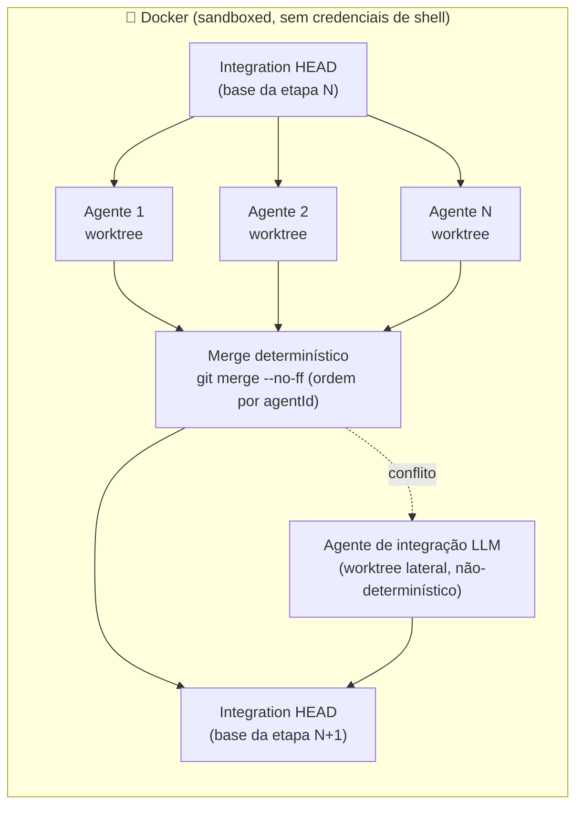
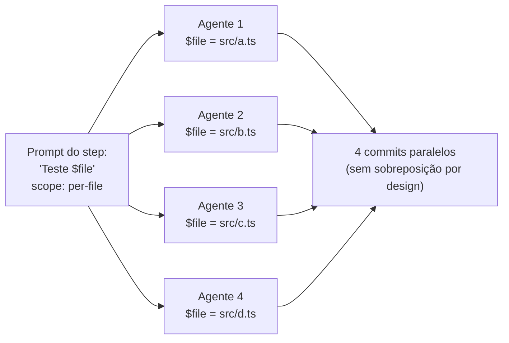
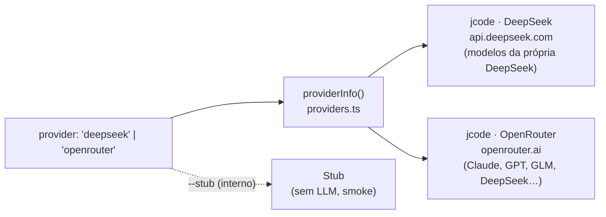

<p align="center">
  
</p>

<p align="center">
  <em>55 minutos do <code>huu</code> gerando uma suíte de testes unitários — acelerados pra 10 segundos.
  Execução real de exemplo (100% de cobertura de <strong>linha</strong> nesta run), <strong>não</strong> uma garantia de
  resultado — veja a ressalva sobre cobertura no <a href="#showcase-huu-test-suite">showcase</a>.</em>
</p>

<h1 align="center">huu</h1>

<p align="center">
  <strong><code>huu</code> — <em>Humans Underwrite Undertakings</em> (humanos subscrevem empreitadas).</strong>
</p>

<p align="center">
  <em>O orquestrador de agentes onde o <strong>método é seu</strong> e a <strong>inteligência é do modelo</strong>.</em>
</p>

<p align="center">
  Um pipeline em JSON vira agentes paralelos — <strong>um por arquivo</strong> — em git worktrees isolados,
  mesclados a cada etapa de forma <strong>determinística no método e na ordem de merge</strong>
  (<a href="MANIFESTO.md">não no resultado</a>), com suas credenciais protegidas em Docker.
</p>

<p align="center">
  <a href="MANIFESTO.md">Manifesto</a> · <a href="README.en.md">English</a> · <strong>Português (BR)</strong>
</p>

<p align="center">
  <a href="https://www.npmjs.com/package/huu-pipe"></a>
  <a href="#licença"></a>
  <a href="https://www.repostatus.org/#active"></a>
  
  
  
  <a href="docs/README.md"></a>
</p>

<p align="center">
  <sub>Projeto jovem, essencialmente de autor único e com desenvolvimento fortemente assistido por IA —
  veja <a href="#status--maturidade">Status &amp; maturidade</a> antes de levar pra produção crítica.</sub>
</p>

---

## Os quatro primitivos de orquestração

| | Primitivo | O que faz |
|---|---|---|
| 🗺️ | **Map** — fan-out `per-file`/`memory` | o mesmo prompt vira N agentes em paralelo, um por arquivo (`$file` + `$hint`), cada um em seu git worktree |
| 🔀 | **Switch** — check steps | um judge LLM com shell emite um veredito JSON e o cursor segue o outcome (com `default` seguro e `maxRuns`) |
| ◇ | **Parallel + Join** — [`dependsOn`](docs/pipeline-json-guide.md) | ramos heterogêneos rodam juntos em **ondas determinísticas**; a **ordem** das ondas e dos merges é a mesma em toda execução (o *conteúdo* de cada nó é do modelo — e um merge com conflito cai num resolvedor LLM) |
| 🧠 | **Memory** — [`produces` → `filesFrom`](docs/memory-scope.pt-BR.md) | uma etapa **descobre** o trabalho e a próxima fan-outa sobre ele — zero seleção humana de arquivos; o contrato de formato é injetado pelo huu |

Compõem livremente: *descoberta → fan-out por memória → ramos paralelos →
join julgado → rework em cascata* — tudo visível no kanban, tudo
reproduzível **na topologia**. Quebrou algo? Todo erro fatal vem com
**causa + próximo passo** ([troubleshooting](docs/troubleshooting.pt-BR.md)).

## O que é o huu

**O huu desenha pipelines que fazem agentes que pensam seguirem um
processo determinístico.** Ele não é uma ferramenta para desenvolver
features novas: o foco é auditoria, geração de testes e extração de
conhecimento — o método é fixo e o agente entra com a inteligência,
não com o escopo.

**Um pipeline é um arquivo de ordens que a IA obedece.** Você escreve
um `huu-pipeline-v1.json` listando os passos e os arquivos que cada
passo toca. O orchestrator transforma cada passo em um fan-out de
agentes paralelos — um agente por arquivo quando você pede assim —
roda eles em worktrees git isolados, e mescla tudo de volta num único
branch de integração **entre cada etapa**. A execução inteira é
sandboxed em Docker, então o agente nunca vê suas credenciais de shell.

Essa frase tem algumas afirmações que vale destacar:

- **O humano subscreve o escopo.** Nenhum planner LLM decide o que o
  passo 3 deve fazer ou quais arquivos ele deve tocar. Se um passo for
  mal projetado, o resultado vai ser previsivelmente e auditavelmente
  errado — não surpreendentemente errado.
- **Determinístico no método e na ordem de merge, não no resultado.** A
  topologia do pipeline, os escopos, os pontos de merge e a ordem
  (`git merge --no-ff`, branches ascendentes por agentId) são idênticos
  em toda execução. O que o modelo escreve *dentro* de cada nó é livre —
  e quando um merge conflita, a resolução cai num **agente de integração
  LLM** (não-determinístico, por construção). Duas runs do mesmo pipeline
  produzem diffs diferentes; é onde a criatividade do modelo paga o custo
  dela. O [MANIFESTO](MANIFESTO.md) desenvolve essa tese.
- **Em modo `per-file`, um agente recebe um arquivo.** O prompt é
  idêntico entre os N agentes — só `$file` é substituído. Sem
  degradação de contexto entre agentes, sem drift de escopo. Cada
  agente é um subprocesso `jcode` novo (o backend padrão), rodando
  *stateless* — zero embeddings, nenhuma memória entre turnos: todo o
  contexto vai pra sua missão única.
- **Pipelines são portáteis, não presos a um provider.** Um
  `huu-pipeline-v1.json` é um artefato versionado — comite, compartilhe
  como gist, contribua pro cookbook. O know-how de *como decompor essa
  classe de tarefa* mora em JSON puro.

---

## Para quem o huu serve (e o que ele NÃO é)

Decida em 30 segundos se isto é pra você:

- ✅ **Serve** se o seu método cabe numa lista ordenada de passos e o
  valor está em executá-lo com **disciplina e reprodutibilidade sobre N
  arquivos**: auditoria, geração de testes, extração de conhecimento,
  migração mecânica em massa. Você escreve o escopo uma vez; 30 agentes
  obedecem em paralelo.
- ❌ **Não serve** pra "conserte esse bug" ou "construa essa feature".
  Trabalho aberto, one-off, sem método repetível pede um agente
  interativo (Claude Code, Cursor) ou autônomo (OpenHands). Escrever um
  pipeline pra isso é overhead — e "construa o app X" não é um pipeline,
  é uma aposta.

A regra prática: **quando cada passo exige uma decisão aberta de design,
não é trabalho pro huu. Quando o método é conhecido e só falta
executá-lo com rigor, é exatamente o trabalho pro huu.**

---

## Início rápido

**Pré-requisitos:** Node.js ≥ 20, `git` e Docker (obrigatório) — **um Docker de
fábrica basta; o plugin `buildx` NÃO é necessário**. O `Dockerfile` não usa
nenhuma sintaxe exclusiva do BuildKit (sem cache mount, sem `COPY --link`, sem
heredoc), então o builder clássico constrói a imagem inteira; quem reintroduzir
uma delas é reprovado no gate por `scripts/check-dockerfile.ts`. Exporte a
chave do **provedor** que você vai usar: `DEEPSEEK_API_KEY`
([platform.deepseek.com](https://platform.deepseek.com)) no padrão, ou
`OPENROUTER_API_KEY` ([openrouter.ai/keys](https://openrouter.ai/keys)) se
rodar com `--provider=openrouter`.

### Docker

```bash
git clone https://github.com/frederico-kluser/huu
cd huu
docker build -t huu:local .
export DEEPSEEK_API_KEY=sk-...          # ou OPENROUTER_API_KEY=sk-or-... com --provider=openrouter
HUU_IMAGE=huu:local huu run pipelines/huu-test-suite.pipeline.json
```

> Desenvolvendo no repositório? `npm start` (e `npm run dev:docker`)
> **reconstroem a imagem `huu:local` automaticamente** antes de rodar
> (`scripts/ensure-image.sh`, com cache de camadas — ~2s sem mudanças), então
> o container sempre executa o código-fonte atual. `HUU_IMAGE=<outra>` pula o
> rebuild (pin deliberado). Já `npm run dev` roda **nativo, sem Docker
> nenhum** (`HUU_DEV_NATIVE=1`) pro loop de edição instantâneo — sem
> isolamento de container e sem teto de memória do container, então é atalho
> de quem desenvolve o huu, não modo de uso.

> Abra **http://localhost:4888** no navegador — a **interface web é o
> padrão**. Dentro do Docker o servidor roda no container e a porta é
> publicada pro host automaticamente. Prefere o terminal? `huu --cli`.

> O huu materializa os pipelines default empacotados em `./pipelines/` no
> primeiro launch — escolha um na UI ou passe o caminho.

Imagens pré-buildadas em `ghcr.io/frederico-kluser/huu:latest` — o
wrapper puxa automaticamente quando nenhum `HUU_IMAGE` está setado.
MTU VPN-aware, mount de secrets, forwarding de sinais e limpeza de
órfãos são todos cuidados pelo wrapper.

### Via npm

```bash
npm install -g huu-pipe        # Node 20+, `git` e Docker
huu                            # re-executa sozinho no container
```

O huu é **docker-only**: todo run executa no container, que carrega o
teto de memória do kernel (`--memory`); não existe modo nativo. As
antigas `--yolo` / `--no-docker` / `HUU_NO_DOCKER=1` foram
**removidas** — se aparecerem, o huu avisa em uma linha, ignora e
re-executa no Docker mesmo assim. Só `--help` e os utilitários de host
(`init-docker`, `status`, `prune`) rodam fora do container. Matriz
completa de instalação (macOS / Windows / Linux, notas do OrbStack,
caveats do WSL2):
[`docs/onboarding.pt-BR.md#instalação`](docs/onboarding.pt-BR.md#instalação).

A UI (web por padrão, ou a TUI com `--cli`) abre num dashboard: comece
pelo `huu Test Suite` (o pipeline default já materializado) ou monte o
seu **sem escrever JSON na mão** — veja a próxima seção.

---

## Interface web (padrão)

Rodar `huu` abre uma **interface web** no navegador — design inspirado
na Apple (vidro líquido, claro/escuro), tempo real, sem delay. É o
mesmo Orchestrator da TUI; só muda a cara. A flag **`--cli`** volta pra
TUI no terminal.

- **Padrão e sem fricção.** `huu` → web. `huu --cli` → terminal. O
  front-end (web/CLI) é ortogonal ao runtime — que é **sempre o
  container** (o huu é docker-only).
- **Sempre no Docker.** O servidor sobe dentro do container e a porta é
  publicada pro host (`-p`) automaticamente.
- **Na sua rede.** Por padrão escuta em `0.0.0.0` — abra do celular ou de
  outra máquina via `http://<ip-da-sua-máquina>:4888`. Tempo real por
  Server-Sent Events (reconecta sozinho), zero dependência nova (só
  `node:http`).
- **Feche a aba, a execução continua.** `huu` abre na tela **inicial**, ou já
  vai direto pro **kanban** ao vivo quando um pipeline já está rodando. A
  execução vive no processo do huu, não no navegador — feche a aba e reabra
  quando quiser pra re-sincronizar; só o botão **Parar** ou encerrar o `huu`
  (Ctrl+C) finaliza a execução. O tempo real tem um **watchdog de liveness**:
  um heartbeat `event: ping` de verdade + detecção de stream travado (60s)
  **reconectam sozinhos** um SSE zumbi, sem você dar refresh — e a **fila
  sobrevive a um reload**: ela persiste status + `runId` e **re-liga** nas
  execuções vivas em vez de resetar tudo pra "pendente".
- **Tudo clicável — e o verde não mente.** Kanban de cards (agentes, merges,
  juízes) fluindo TODO → DOING → DONE — quando um card muda de coluna ele
  **desliza até a primeira posição da nova coluna** (animação por GPU, só
  `transform`, sem travar), e cada coluna **rola sozinha** quando enche em vez
  de achatar os cards. **`DONE` verde agora significa MESCLADO:** um card só
  fica verde quando o branch do agente de fato entra na integração (por-branch,
  ascendente — uma ondinha visível durante o merge da etapa). Até lá, uma task
  que terminou aparece como card azul **`READY`** ainda em DOING; se a
  integração falhar (ou o run acabar) sem o branch entrar, ela vira um card
  âmbar **`UNMERGED`** — o trabalho está commitado no branch do agente, só não
  mesclou — em vez de um falso verde. E card **`PAUSED`** (pela guarda de
  memória) fica na coluna **TODO**, porque a task foi literalmente
  re-enfileirada. Clique num card pra ver **tokens, custo, branch, arquivos e
  logs ao vivo** por agente. Console de log global, controle de concorrência
  (Auto · Manual) e botão de parar no topo.
- **Erro sinalizado e re-execução por card.** Um card que **estourou o tempo
  limite** aparece em **âmbar** (`timeout`), distinto do **vermelho** de
  qualquer outra falha (`failed`). Quando uma execução termina com cards em
  erro, o huu **não pula direto pro resumo**: ele pausa em modo **review**
  (mantendo o worktree de integração vivo) pra você recuperar as falhas uma a
  uma. Clique no card vermelho/âmbar e use **Retry** — um timeout ainda oferece
  um **novo tempo limite** maior; qualquer outro erro só re-executa. O card roda
  de novo sobre o HEAD atual da integração e, se passar, é mesclado — sem
  re-rodar o pipeline inteiro. O botão **Finish** encerra o review. (No TUI:
  `R` re-tenta o card em foco, `D` finaliza — tanto na execução única quanto,
  por run, no painel multi-run.)
- **Tempo máximo por agente — global e por projeto.** Um painel de **Settings**
  (⚙ no topo) guarda um **Max time per agent** global (minutos) que limita o tempo
  de **cada agente** em toda a pipeline, para **todo run iniciado neste navegador**;
  o campo **por pipeline** no launch **sobrescreve** o global (vazio = herda). Vazio
  em tudo usa o padrão da pipeline (10 min · 5 min em single-file). O global e o
  valor por pipeline persistem no navegador e ficam no histórico. **Só na Web UI —
  o CLI mantém as próprias regras.** (Antes só dava para ajustar o tempo **ao
  re-tentar** um card já estourado; configurar no início era só no TUI.)
- **Launch guiado (pipeline → projetos → fila) — em paralelo, com admissão
  inteligente.** Monte a fila em passos: **escolha uma pipeline** → **marque um
  ou mais projetos** navegando pelo sistema de arquivos (cada pasta tem um
  **checkbox** — marque quantas quiser, ou use **“☑ Mark all”** para marcar
  todas as subpastas da pasta atual de uma vez; as marcas persistem enquanto
  você navega) → **configure aquela pipeline** (provider, modelo, concorrência, tempo
  — **compartilhados por todos os projetos marcados**) e ela **se expande em uma
  execução por projeto** na fila. Então **adicione outra pipeline** (com seus
  próprios projetos e config) ou **rode a fila**. A fila mostra tudo **agrupado
  por pipeline**. Tudo roda em paralelo sob um **único orçamento de
  RAM/concorrência** da máquina: o servidor admite o primeiro **na hora** e
  segura os demais em **`na fila`**, puxando cada um só quando há folga de
  memória **sustentada** — ou seja, **não dispara a máquina toda de uma vez**
  (era exatamente o que derrubava o processo com muitos projetos). Os projetos
  anteriores têm prioridade; os posteriores fazem **backfill** das vagas ociosas
  (ex.: enquanto um está em merge), e sob pressão de memória **pausa-se** primeiro
  o agente mais novo do projeto de menor prioridade (trabalho preservado e
  retomado com a folga; `HUU_NO_PAUSE=1` volta a matar). Rodar a **mesma pipeline
  em vários projetos** — ou **vários projetos no mesmo repo** — é seguro: cada
  execução isola worktrees/branches por `runId`. **Quanto da RAM o huu pode usar
  é um dial** (Settings → **RAM budget %**, ou `HUU_RAM_PERCENT` /
  `--ram-percent`; padrão 70%, o resto fica reservado pro sistema) — e o dial da
  web agora **aplica na hora**: mudar vale **imediatamente** pras execuções em
  andamento **e** pras da fila, e o valor **persiste no servidor**
  (`~/.config/huu/web-settings.json`). Um **chip de orçamento** no topo mostra
  ao vivo o dial em vigor, o par de RAM **honesto e do tamanho da máquina**
  (`huu 1.2/14.0G · host 10.2/16.0G` — o consumo do huu **e** o da máquina
  inteira, não só a fatia do cgroup do container, que sempre parecia "mais
  vazia" do que o computador de verdade), PSI, o nível de pressão da guarda e um
  **contador global de agentes** (`agents live/B`) somando todos os projetos;
  a fila aceita até **256 projetos** (`HUU_MAX_QUEUED_RUNS` — projeto na fila
  não custa orçamento) e, sob pressão, uma execução com todos os agentes retidos
  mostra um selo âmbar pulsante **paused (RAM)** e retoma sozinha quando a
  memória liberar. E o dial não é a última defesa: o container carrega um
  **teto de memória do kernel** (`--memory` = total do host menos a reserva
  do SO) — o pior caso derruba o huu, **nunca congela o host**. Um
  **seletor de projetos** no topo (**projeto · pipeline**) alterna entre os
  boards ao vivo.
  **Com a fila rodando, dá para voltar à home (← Home) e adicionar mais
  pipelines/projetos** — eles **entram na fila** e são admitidos conforme a
  capacidade libera. Se um falha, os outros seguem. Cada execução é arquivada no
  **histórico** do navegador (IndexedDB) com todos os cards, os custos por card e
  o total por projeto — **exportável em JSON** com um clique.
- **Log ao vivo, de verdade — agora um console de atividade.** O texto que o
  agente vai gerando entra no log **conforme sai** — não só nas trocas de
  ferramenta. O cabeçalho do log virou uma **barra de atividade ao vivo**: soma
  quantas tasks estão rodando **agora, somando todos os projetos** em execução
  (`⚡ N rodando · M projetos · Q na fila`), atualizado em tempo real. Cada
  agente ganha uma **cor estável** e os níveis de aviso/erro saltam com glyph e
  trilha colorida; com mais de um projeto vivo, as linhas de todos se fundem num
  **stream único** ordenado por tempo, cada linha marcada com seu projeto. E
  **tudo que o agente devolve** (resposta + raciocínio) segue espelhado em tempo
  real no **console do navegador** (DevTools → Console), com o id do agente em
  cada linha; silencie com `window.HUU_LOG_STREAM = false`.
- **Sua key, no navegador — e agora também em ⚙ Settings, validada e
  persistente.** O formulário de launch renderiza **uma linha por credencial
  que o provedor escolhido realmente exige** — cole ali e é **validada na hora**
  contra o provider, ficando só na aba (`sessionStorage`), como antes. Ou salve
  de vez em **Settings (⚙) → OpenRouter API key**:
  **Validate & save** checa a key contra o OpenRouter (**uma key rejeitada
  nunca é salva**), grava no store do host (`~/.config/huu/config.json` — agora
  **montado dentro do container**, então salvar em Options finalmente
  sobrevive ao Docker) e passa a valer **imediatamente para todo novo run**,
  desta aba ou não, inclusive nas próximas sessões do huu. O painel mostra
  **qual key está ativa e de onde veio** (Options · env · secret do host,
  sempre mascarada), avisa quando uma `OPENROUTER_API_KEY` do shell está sendo
  **ignorada** pela key salva, e o link **clear saved key** volta pra env var.
  E quando um run tem a key recusada (401), a mensagem culpa **a key realmente
  usada** — inclusive a da aba — em vez de apontar sempre pra key salva.
- **O terminal do huu voltou a falar.** O terminal que iniciou o huu
  (`npm start` / `huu`) agora **loga tudo que importa**: run na
  fila/iniciado/concluído/falhou (com duração e custo), a atividade de cada
  agente/merge/judge por projeto, **qual key (mascarada) cada run usa**, cada
  validação/salvamento/limpeza de key e toda execução recusada — **problemas E
  acertos**. Antes era banner de startup e silêncio (um 401 parecia "não fez
  nada"). `HUU_WEB_LOG_STREAM=1` espelha também a saída bruta dos agentes. No
  navegador, falha de launch/preflight agora dispara **toast** em vez de só
  colorir o chip da fila.
- **Seletor de modelo com busca, filtrado pelo provedor.** O campo **Model** é
  um combobox com busca (digite pra filtrar) sobre o catálogo curado do huu
  (`recommended-models.json`), **restrito ao provedor que você escolheu** — um
  run DeepSeek nunca recebe uma entrada Claude, porque a api.deepseek.com só
  serve os modelos dela. O catálogo é estático e não precisa de key, então a
  lista carrega assim que você abre o seletor (não há busca ao vivo: a DeepSeek
  não expõe endpoint `/models` público). Os modelos vêm **com selo**
  (`reasoning`, e um aviso leve `no tools`) em vez de escondidos, e você pode
  **digitar qualquer id de modelo** — até um que não esteja na lista — pra
  rodar verbatim.

> **Hoje a web roda pipelines existentes** (listar, escolher, enfileirar e
> executar em paralelo, ajustar concorrência, parar). Os **construtores
> guiados** (Pipeline
> Assistant e o editor passo a passo) ainda vivem na **TUI** — use
> `huu --cli`. Autoria de pipeline pela web é roadmap.

> **A TUI (`huu --cli`) tem as mesmas features core de execução.** N projetos em
> paralelo com fan-out real (`P` no Welcome: marque as pastas, escolha as
> pipelines, revise a fila), **admissão preguiçosa** com fase `queued` (o
> primeiro run entra na hora, os outros esperam folga sustentada de RAM — a
> mesma regra da web e do `run-many`), **chip de budget máquina-global**
> (`dial N%` · `agents live/B` · RAM · host free · `N queued` · pressão),
> **dial de RAM** editável em Options (mesmo store que o ⚙ Settings da web —
> uma máquina, uma RAM), **retry por card** em qualquer run e um **resumo de
> batch** no fim. A TUI segue à frente na AUTORIA (Assistant, editor de steps,
> file picker com Smart Select, catálogo de modelos com métricas) e no modo
> **MAX/greedy**, que a web não expõe.

> **Sobre "custo":** o custo e os tokens **por card/agente** são reais
> (acumulados dos eventos de uso do backend, quando o provider os
> reporta). O **header soma esses custos por card em tempo real**
> (`totalCost`). Única ressalva: o custo de LLM dos cards de
> **merge/judge** ainda não é medido — só os agentes de trabalho.

```bash
huu                       # UI web (padrão) — http://localhost:4888
huu --port=8080           # porta custom (ou HUU_WEB_PORT=8080)
HUU_WEB_HOST=127.0.0.1 huu # só localhost (não expõe na LAN)
HUU_WEB_TOKEN=segredo huu # exige ?token=segredo pra dados/ações
huu --cli                 # TUI no terminal
```

| Variável | Faz |
|---|---|
| `HUU_WEB_PORT` / `--port=<n>` | Porta (default `4888`). |
| `HUU_WEB_HOST` | Endereço de bind (default `0.0.0.0`; `127.0.0.1` = só local). |
| `HUU_WEB_TOKEN` | Segredo compartilhado exigido nas rotas de dados/ações. |
| `HUU_WEB_LOG_STREAM=1` | Espelha também a saída **bruta** dos agentes no terminal que iniciou o huu (o log de ciclo de vida — runs, keys, erros — é sempre ativo). |
| `HUU_CLI=1` | Default pra TUI (igual a `--cli`). |
| `HUU_RAM_PERCENT` / `--ram-percent=<n>` | Orçamento de RAM como % do total da máquina (default `70`, faixa 10–95). Também na Web em Settings → RAM budget % — **aplicado ao vivo pela web** (vale na hora pra execuções atuais + fila, persistido no servidor). |
| `HUU_NO_HOST_CLAMP=1` | Desliga o clamp por **disponibilidade do host** (o huu volta a planejar só pelo dial/cgroup do container). Use em hosts dedicados ao huu. |
| `HUU_OOM_SCORE_ADJ` | Ajuste do `oom_score_adj` do processo huu (default conservador; best-effort — valor negativo só "pega" com `CAP_SYS_RESOURCE`, que nem o container tem; a alavanca real é `HUU_CHILD_OOM_SCORE_ADJ`, que sobe os subprocessos dos agentes pra +500). |
| `HUU_JCODE_HERMETIC=0` | Escape de debug: desliga o **runtime jcode hermético**. Por padrão todo subprocesso `jcode` recebe `JCODE_MEMORY_ENABLED=false` (zero embeddings), `JCODE_NO_TELEMETRY=1`, um `JCODE_AGENT_DIR` isolado e um `JCODE_HOME` em `~/.huu/jcode-home` com um `config.toml` que o próprio huu escreve — o `~/.jcode/config.toml` do host é **ignorado**. Com `=0`, o `process.env` vai intacto e o jcode volta a resolver a config pelo host. O wrapper já forwarda essa variável pro container — não precisa de `HUU_DOCKER_PASS_ENV`. |
| `HUU_AGENT_MEM_SEED_MB` | Seed do footprint por-agente do AutoScaler (MiB, clamp 128–4096; default pessimista `1536`). Baixe SÓ com medição — veja `scaler`/`ema_move` no debug log. |
| `HUU_AGENT_MEM_EMA_ALPHA` | Fator da EMA do footprint observado (0.01–1; default `0.2`). Maior = converge mais rápido do seed pro valor real. |

### Modo simulação (`/simulation`)

Abra **`http://localhost:4888/simulation`** para uma **simulação completa** do
huu em ação — kanban, agentes, logs ao vivo e contadores de custo — **sem
criar nenhuma branch, sem chave de API e sem custo**. Tudo é sintético: um
`SimulationEngine` fabrica os mesmos frames de estado que o Orchestrator real
emite, então a mesma tela renderiza sem mudança nenhuma. É feito para **demos
e material de divulgação**.

Ao abrir, você escolhe **os modelos** (viram rótulos nos cards), a **quantidade
de arquivos** e a **quantidade de agentes simultâneos**, e inicia. Cada execução
**sorteia o mix completo de cenários**: streaming, requeues do memory-guard
(`↻`), retries, erros, merges de stage e o **loop de rework do juiz**
(`rework → approved`). Tem **play/pause** durante a corrida e um botão **"Run
again"** ao terminar. Nenhum arquivo do seu projeto é tocado.

---

## Monte um pipeline sem escrever JSON na mão

Você não precisa abrir um editor de JSON pra começar. A **TUI**
(`huu --cli`) tem duas formas guiadas de criar um pipeline, ambas a
partir da tela de boas-vindas:

<p align="center">
  
</p>

- **Construtor guiado — tecla `N`.** Abre um **seletor de padrões**
  (Discover → Act com par de memória pré-ligado · Per-file transform ·
  Audit with judge · Blank) que já monta os steps ligados; daí você edita
  etapa por etapa. Pra cada step você escolhe o **scope** (`project`,
  `per-file`, `memory` ou `flexible`), as **dependências** entre steps
  (`dependsOn` — formam ondas determinísticas: dá pra abrir um galho em
  ramos paralelos que se juntam num step seguinte) e os **check steps**
  (um juiz que aprova, volta pra um step anterior ou ramifica, com
  `maxRuns`). O rodapé sempre mostra as teclas do campo em foco.
- **Pipeline Assistant — tecla `A`** (em magenta, a cor reservada à UI
  movida a IA). Descreva sua demanda em linguagem natural e responda
  algumas perguntas de múltipla escolha. O huu faz um recon do projeto em
  paralelo, esboça a estrutura (o *Architect flow* compara rascunhos sob
  lentes diferentes) e entrega um pipeline **já validado** pelo schema e
  pela topologia reais — **que você então edita** no mesmo construtor.
  Você continua subscrevendo o escopo: a IA monta o rascunho, você revisa
  e aprova.

> Esses dois fluxos são **da TUI** (`huu --cli`). A interface web (padrão)
> hoje executa pipelines existentes; a autoria guiada pela web é roadmap.

Mapa de teclas completo: [`docs/KEYBOARD.md`](docs/KEYBOARD.md) ·
tutorial passo a passo:
[`docs/onboarding.pt-BR.md`](docs/onboarding.pt-BR.md).

---

## Etapa → merge → etapa



Cada etapa ramifica N agentes a partir do HEAD de integração, deixa
eles trabalharem em paralelo nos seus próprios worktrees, e mescla
tudo de volta **antes** da próxima etapa começar. A barreira é
`git merge --no-ff`, em ordem ascendente de agentId — um algoritmo de 20
anos, não um LLM coordenador. O worktree de integração nunca dá rewind —
loops re-executam em cima do HEAD atual, acumulando commits. **Conflito
real é o único ponto onde a IA entra no plano de controle:** cai num
agente de integração LLM lateral (pulado no modo `--stub`), e a
resolução dele *não* é determinística. É o fallback pra pipelines mal
projetadas, não o caminho principal.

### Scope per-file: um agente, uma missão



Mesmo prompt, `$file` diferente. Agentes leem o worktree inteiro pra
contexto mas são instruídos a escrever só no arquivo atribuído —
escritas disjuntas geram merges limpos. **Porque o pipeline é só um
contrato declarativo, o mesmo arquivo roda um agente ou trinta —
escalando horizontalmente sem mudar os passos.**

### Scope memory: o pipeline escolhe os arquivos, não o humano

`per-file` ainda exige que alguém selecione os arquivos. O scope
`memory` remove até isso: uma etapa anterior **escreve um arquivo de
memória** (`huu-memory-v1`) listando os paths — com um `hint` opcional
por arquivo — e a etapa com `scope: "memory"` + `filesFrom` fan-outa
**um agente por entrada**, lendo a lista do worktree de integração na
hora de executar. O `hint` do produtor chega ao prompt do consumidor
via token `$hint`, junto do `$file`. O contrato de formato é injetado
automaticamente pelo huu (`src/lib/memory-contract.ts`), então o prompt
do produtor fica limpo.

Scan → fix, recon → estudo, rank → refactor: o passo de descoberta
decide o trabalho e o fan-out obedece, sem nenhum clique de seleção.
**É assim que todos os pipelines default funcionam hoje — autônomos, sem
você apontar arquivo nenhum.** Guia completo:
[`docs/memory-scope.pt-BR.md`](docs/memory-scope.pt-BR.md).

---

<h2 id="showcase-huu-test-suite">Showcase: huu Test Suite</h2>

`huu Test Suite` é o pipeline default materializado na primeira
execução. Ele demonstra por que misturar `project`, descoberta por
memória e um juiz é a receita — **sem você escolher um único arquivo**.

| # | Step | Scope | O que faz |
|---|---|---|---|
| 1 | Analisa stack e escreve `huu-tests.md` | `project` | Detecta a linguagem (Node / Python / Go / Rust / Java / .NET), confere o test runner, escreve o **plano** que todos os passos seguintes obedecem. |
| 2 | Seleciona alvos de teste | `project` → `produces` | **Recon autônomo:** escreve a lista `huu-memory-v1` dos arquivos mais test-worthy (com um `hint` por arquivo). **Sem seleção manual.** |
| 3 | **Escreve testes pra `$file`** | `memory` (fan-out) | **N agentes em paralelo, um por arquivo da lista do passo 2.** Mesmo prompt, `$file`/`$hint` diferentes; cada um segue o `huu-tests.md`. |
| 4 | Limpeza + badge de cobertura | `project` | Roda a suíte completa, deleta só os **blocos** com falha (nunca arquivos inteiros), mede a cobertura de **linha** que emergir e atualiza o badge no README. |
| 5 | Suíte verde? | `check` (maxRuns 2) | Um juiz roda a suíte: `approved` → finaliza (default, caminho pra frente); `rework` → volta pro passo 4. |
| 6 | Finaliza | `project` | Stamp final e remove o arquivo de alvos transitório. |

Step 1 escreve um contrato; step 2 descobre o trabalho; step 3 faz N
agentes obedecerem em paralelo; o juiz do step 5 fecha o loop.
**Planeje em `project`, descubra e execute em `memory`, valide com um
juiz** — o template pra tudo o mais.

> **Ressalva honesta sobre cobertura.** O pipeline **não** mira nem
> garante 100%. O gate é "**a suíte passa**" (exit 0); a cobertura de
> linha é **medida e reportada**, não exigida — a run do GIF deu 100%,
> outra pode dar 70%. E cobertura de linha só prova que o código
> *rodou*, não que as asserções pegariam um bug: os prompts já miram
> **asserções que sobrevivem a mutation testing** e regras de
> determinismo anti-flaky, e o próprio `huu-tests.md` aponta mutation
> testing (Stryker/mutmut/PIT) como o follow-up que mede qualidade de
> verdade. Trate 100% de cobertura como **ponto de partida, não prova**.

Passo a passo com prompts:
[`docs/onboarding.pt-BR.md#exemplo-passo-a-passo`](docs/onboarding.pt-BR.md#exemplo-passo-a-passo).

---

## Para que o huu serve — os pipelines empacotados

O formato **planejar → descobrir → fan-out → mergear → julgar** brilha
em processos com previsibilidade real de valor. Sete pipelines já vêm
empacotadas (só `huu Test Suite` é marcada como o default; todas são
**autônomas** — descobrem os próprios alvos via recon + `scope: memory`,
sem você apontar arquivos):

- **Auditorias** (cinco defaults: Security, Quality, Docs, Performance,
  Refactor Plan) — **relatório-apenas** estrito: escrevem **só** em
  `.huu/audits/<tópico>.md`, `<tópico>-faq.json` e
  `<tópico>-targets.json` (mais arquivos de trabalho sob
  `.huu/audits/.tmp/`), e no máximo **um** ajuste de `.gitignore` pra
  que os relatórios sobrevivam ao merge. Nunca tocam `README.md`,
  `package.json`, lockfiles ou source de produção. Ferramentas
  auxiliares (gitleaks, semgrep, jscpd, lighthouse-ci…) rodam efêmeras
  via `npx --yes`/`pipx run` — nunca entram nos seus manifests. Cada uma
  é ancorada em metodologia publicada (OWASP Top 10:2025,
  churn×complexidade, Diátaxis, Core Web Vitals, Fowler/Mikado) e
  **termina com um agente juiz** que valida o relatório e devolve pra
  retrabalho (`rework`, `maxRuns 2`) se as contas não fecharem.
- **Geração de testes** (`huu Test Suite`, o default) — **muta o repo
  por construção** (escreve `huu-tests.md` na raiz e insere o badge de
  cobertura no `README.md`). Regras de asserção que sobrevivem a mutation
  testing e regras de determinismo anti-flaky embutidas nos prompts.
- **Extração de conhecimento** (`huu Knowledge System`) — também **muta o
  repo por construção** (`.agents/skills/**` + `.huu/knowledge/**`).
  Totalmente autônoma via scope `memory`: o recon escolhe sozinho os
  arquivos de estudo (com um hint por arquivo), o estudo profundo
  converge em `.huu/knowledge/`, dossiês por tópico viram **Agent
  Skills** ([spec](https://agentskills.io/specification)) sob
  `.agents/skills/` com **um agente paralelo por skill**, mais
  meta-skills de evolução e uma superfície de roteamento router-aware
  (estende seu `catalog.md` se já existir) — selada por um **eval cego
  de roteamento** com loop de retrabalho de descriptions.
- **Processos mecânicos em massa.** *Migrar 40 testes Mocha pra
  Vitest:* etapa 1 audita patterns em `MIGRATION.md`, etapa 2 descobre os
  40 arquivos, etapa 3 ramifica 40 agentes (um por arquivo), etapa 4
  valida com `npm test`. O prompt é idêntico nos 40 — só `$file` muda.
  Previsível por construção.
- **Seu processo.** Se você consegue escrever o método como uma lista
  ordenada de steps com prompts e um `scope`, você consegue rodar.
  O formato do pipeline é estável; o cookbook é aberto.

**O que o huu NÃO é:** uma ferramenta para desenvolver features novas.
Não existe planner LLM inventando escopo, e "construa o app X" não é
um pipeline — é uma aposta. Quando a tarefa exige decisões abertas de
design a cada passo, use um coding agent interativo; quando o método é
conhecido e o valor está em executá-lo com disciplina sobre N
arquivos, use o huu.

Defaults empacotados:
[`docs/onboarding.pt-BR.md#pipelines-default-empacotados`](docs/onboarding.pt-BR.md#pipelines-default-empacotados).

---

## Onde o huu se encaixa — e onde ele difere da concorrência

Pesquisamos ~20 ferramentas open-source de orquestração de agentes. Elas
se separam por **duas perguntas**: *quem decide o escopo* (o humano ou o
LLM?) e *como o trabalho é integrado de volta* (merge determinístico ou
manual?).

```
              MERGE DETERMINÍSTICO, etapa a etapa
                          ▲
            ┌───────────┐ │            ┌─────────┐
            │ Bernstein │ │            │   huu   │  ← decomposição HUMANA +
            └───────────┘ │            └─────────┘    fan-out por arquivo + --no-ff
   ESCOPO ◀───────────────┼───────────────────────▶ ESCOPO
  DO LLM                  │                          DO HUMANO
   OpenHands              │   Conductor · Crystal
   SWE-agent              │   Claude Squad · uzi · vibe-kanban
   Cursor · Amp           │   container-use · Sculptor
                          │   LangGraph · CrewAI · AutoGen
                          ▼   Dify · n8n · Flowise
              MERGE MANUAL (PR / cherry-pick por sessão)
```

O **vizinho mais próximo** é o
**[Bernstein](https://github.com/sipyourdrink-ltd/bernstein)**
(Apache-2.0, v2.7.0): um scheduler **Python determinístico** que roda
uma crew de coding agents CLI (Claude Code, Codex, Gemini CLI e +40) em
**git worktrees, um por tarefa**, com **fila de merge serializada**, um
**"janitor"** que faz gate com testes/lint/tipos antes de mergear, e um
**audit log encadeado por HMAC** (replayável, à prova de adulteração).
Ele compartilha quase tudo o que move o huu — **recusa a um planner LLM
no loop de coordenação** ("zero LLM in the coordination loop"),
isolamento por worktree, merge determinístico e gate de verificação.

**A linha que divide os dois é quem escreve a decomposição.** O Bernstein
faz **uma chamada LLM** pra quebrar o goal em tarefas e segue em Python
puro ("one LLM call, then plain Python from there"). O huu pede que o
**humano** escreva a decomposição — *nem uma chamada*. Daí o que sobra de
genuinamente distintivo no huu é: **fan-out por arquivo** (mesmo prompt
× N arquivos, paralelismo de dados, não de tarefas), os **métodos
prontos** (auditoria/teste/conhecimento) que terminam num juiz, e o
**sandbox Docker que esconde suas credenciais** por padrão.

| Ferramenta | Quem decide o escopo | Isolamento | Fan-out por arquivo | Integração / merge | Sandbox de credenciais | Foco |
|---|---|---|---|---|---|---|
| **huu** | **humano — JSON versionado** | **git worktree + Docker** | **✅ nativo** | **determinístico `--no-ff`, a cada etapa** (conflito → resolvedor LLM) | **✅ por padrão** | **auditoria · teste · conhecimento** |
| **Bernstein** | LLM — **1 chamada** decompõe o goal | git worktree (por tarefa) | ❌ (por tarefa) | fila de merge serializada (determinística) | — (roda agentes CLI no host) | construir features a partir de um goal (audit-grade) |
| Conductor · Crystal · Claude Squad · vibe-kanban · uzi | humano — ad-hoc, por sessão | git worktree | ❌ | manual (diff/PR/rebase por sessão) | ❌ (worktree no host) | construir features |
| container-use · Sculptor | humano — ad-hoc | container | ❌ | manual (`cu merge` · PR) | ✅ container | construir features |
| OpenHands · SWE-agent · Cursor · Amp | **LLM planeja tudo** | container / VM | ❌ | PR aberto pelo agente | ✅ (cloud/local) | construir features · resolver issues |
| LangGraph · CrewAI · AutoGen / MAF | dev — grafo em código | in-process | ❌ | estado compartilhado em memória | ❌ | construir agentes (SDK) |
| Dify · n8n · Flowise | humano — canvas visual | servidor persistente | ❌ | banco de dados | ❌ | apps & automação LLM |

No eixo do *determinismo de orquestração* também vale citar o
**[Conductor da Microsoft](https://github.com/microsoft/conductor)** (CLI
MIT, 2026): roteia entre agentes via templates (YAML/Jinja2, sem LLM no
loop de orquestração) e gasta **zero tokens** pra decidir o próximo
passo. A diferença é o escopo do produto: é um orquestrador **genérico**
de workflows; não isola cada agente num git worktree nem faz fan-out de
código por arquivo. (Não confundir com o *Conductor* da Melty no
quadrante acima — um app desktop de runners paralelos.)

### Onde a concorrência ganha (e quando NÃO usar o huu)

Honestidade primeiro: o huu é um nicho, e a vizinhança é forte. Os
concorrentes têm **ecossistemas muito maiores** (dezenas de milhares de
estrelas, apps desktop nativos, marketplaces de integração, clouds
gerenciadas, respaldo corporativo — a Microsoft uniu AutoGen + Semantic
Kernel no Agent Framework). E há coisas que eles fazem melhor por
construção:

- **Decompor o goal pra você.** O Bernstein quebra o objetivo em tarefas
  com uma chamada LLM e ainda traz **40+ adapters de agentes CLI** e um
  **audit log à prova de adulteração** — pra um goal one-off em que você
  não quer escrever a decomposição, ele tem menos overhead de autoria
  que o huu. O preço do huu (você escreve o pipeline) só compensa quando
  o método se repete.
- **"Só conserta esse bug" / "constrói essa feature".** Trabalho aberto,
  one-off, sem método repetível? Use um agente interativo (Claude Code,
  Cursor) ou autônomo (OpenHands). Escrever uma pipeline pra isso é
  overhead.
- **Comparar 3 soluções e escolher a melhor.** Crystal e uzi fazem
  *candidate-generation* (mesmo prompt × N → você fica com o vencedor)
  como fluxo de primeira classe. O huu não tem essa ergonomia nativa.
- **Esteerar o agente no meio da execução.** O Pairing Mode do Sculptor e
  o diff review por sessão do vibe-kanban são interativos; o huu roda o
  contrato até o fim e te entrega o resultado mergeado.

O huu ganha em **uma coisa**, de propósito: fazer agentes que pensam
seguirem um **processo determinístico e auditável** sobre N arquivos,
onde **o humano — não um LLM — escreve a decomposição**. Quando o método
é conhecido e o valor está em executá-lo com disciplina e
reprodutibilidade de método, poucos outros entregam o mesmo contrato.

---

## Provedores — qualquer modelo, sua escolha

São **dois eixos**, não um — confundi-los é o que já fez um run OpenRouter
exigir `DEEPSEEK_API_KEY`:

- **Backend = *como* o agente roda.** `AgentBackendKind = 'jcode' | 'stub'`
  (`src/orchestrator/backends/registry.ts`). O `jcode` dispara a CLI `jcode`
  como **subprocesso**; o `stub` não chama modelo nenhum.
- **Provedor = *para onde* a chamada vai e *qual credencial* ela gasta.**
  `LlmProvider = 'deepseek' | 'openrouter'` (`src/lib/providers.ts`).

Um backend serve **N provedores**: o `jcode` serve os dois. Por isso o
backend não pode nomear a chave do run — quem responde isso é o provedor.



| Provedor | Flag | Modelo de custo | Status |
|---|---|---|---|
| **DeepSeek** (padrão) | `--provider=deepseek` | Por-token via `DEEPSEEK_API_KEY` — o mais barato; só os modelos da DeepSeek | Recomendado |
| OpenRouter | `--provider=openrouter` | Por-token via `OPENROUTER_API_KEY` — uma chave fronteando muitos fornecedores (Claude, GPT, GLM, DeepSeek) | Estável |
| Stub | `--stub` | Grátis, sem LLM — smoke tests / demos | Estável |

O catálogo do huu é escrito no formato da OpenRouter (`fornecedor/modelo`) e
o id é **renderizado no namespace do endpoint** na hora do spawn: a
openrouter.ai roteia *pelo* prefixo e recebe o id inteiro; a
api.deepseek.com nomeia os modelos dela sem prefixo, então o `deepseek/` cai
(`modelIdForProvider`). Os dois provedores compartilham o mesmo orchestrator,
ciclo de vida de worktree e lógica de merge.

Escolha o provedor na tela de launch (web e TUI) ou trave pela linha de
comando com `--provider=`. A escolha viaja com o run até o spawn, onde
decide de uma vez o `--provider-profile` do `jcode`, o namespace do
`--model` e a variável de ambiente em que a chave é injetada — e as chaves
dos **outros** provedores são removidas do ambiente do subprocesso.

A fundo: [`docs/onboarding.pt-BR.md#backends-a-fundo`](docs/onboarding.pt-BR.md#backends-a-fundo).

---

## Concorrência dinâmica (memória-aware, padrão)

Por padrão o huu **adapta a concorrência ao headroom real de memória**:
ele mede quanto cada agente consome de verdade (média móvel pessimista,
semeada em 1536 MiB e travada entre 128 MiB e 4 GiB — só agentes maduros
entram na conta, e spawns em voo já são cobrados como reserva) e admite
novos agentes só enquanto couberem no orçamento do **dial de RAM**,
descontada uma reserva adaptativa pro SO. E agora é **host-aware**: além do
cgroup do container, ele lê o `/proc/meminfo` do **host** e trava cada
admissão em `min(folga do dial, RAM disponível do host − reserva do SO)` —
então **cede pro resto da máquina** (navegador, IDE) antes de empurrar o host
pro swap, em vez de enxergar só a fatia do container e parecer "mais vazio" do
que o computador está. `HUU_NO_HOST_CLAMP=1` desliga isso em hosts dedicados.

Uma **guarda de memória fica sempre ativa** (mesmo com concorrência
manual ou MAX) — e agora dispara **muito antes** do desastre, numa
**escada de pressão**: uso **sustentado acima do dial de RAM** (L1),
**pressão real do host** no estilo earlyoom — pouca RAM disponível **e**
pouco swap livre, PSI `full` alto ou swap-in sustentado (L2/L3) — e os
~95% de RAM/CPU de antes viram só a **linha legada** de fallback. A cada
disparo o agente **mais novo** — o que tem menos trabalho feito
(escolhido por `startedAt`) — é preemptado. Por padrão ele é **pausado**:
o huu faz checkpoint da sessão do agente, libera a RAM, mas **preserva a
worktree + o transcript**, e o card entra em **PAUSED** (`⏸N`) —
retomando **de onde parou** assim que houver folga. No L1 a escada
**nunca derruba abaixo de 1 agente vivo**: a execução degrada pra
sequencial, nunca pra zero. Se não der pra fazer checkpoint (ou com
`HUU_NO_PAUSE=1`), cai no comportamento anterior: o agente é **morto**,
o card **volta para a coluna TODO** com um contador `↻N` e a task
recomeça do zero. O trabalho dos agentes mais antigos nunca é perdido. Cada
linha de pausa/kill carrega **o motivo exato** que a escada de pressão viu
(`avail 0.4% + swap free 0.0% below emergency floor`), em vez de um "RAM 9%"
enganoso, e uma **espera anti-churn** (backoff exponencial + jitter
determinístico, mais um *calm hold* pós-tempestade) impede o vai-e-vem
pausa↔retoma sob pressão sustentada. Detalhes e os knobs `HUU_GUARD_*`:
[`docs/operations.pt-BR.md`](docs/operations.pt-BR.md).

Controles:

| Onde | Como |
|---|---|
| CLI | `--concurrency=N` pina manual em N · `--no-auto-scale` desliga o modo dinâmico |
| TUI | `+`/`-` ajustam (e pinam manual) · `A` religa o auto-scale · `M` modo MAX/greedy (inunda até o TETO do dial de RAM — budget-greedy) |
| Web | Toggle **Auto ⇄ Manual** no topo — o **MAX saiu da web** (todo run web é subordinado ao scheduler compartilhado; POSTs `greedy` legados viram `auto`) |
| Headless | `"concurrency": N` no config pina manual; omita para o modo dinâmico |

---

## Modo de desenvolvimento (`huu dev`)

O único fluxo do huu cujo **grafo de passos é escrito em tempo de execução**.
Você escreve o objetivo; um planejador o decompõe em **frentes** paralelas;
cada frente vira `recon → enxame de agentes em worktrees (cada tarefa revisada
por um crítico antes do merge) → juiz`.

```bash
# Autônomo — O PADRÃO: planeja e roda todas as épocas sem perguntar nada
huu dev "migrar o parser para streaming sem quebrar a API pública" \
    --model=anthropic/claude-sonnet-4

# Optando POR um portão humano a cada época
huu dev "extrair o cliente HTTP para um pacote próprio" \
    --model=anthropic/claude-sonnet-4 --approve-each --epochs=2
```

Na web, um **switch** no topo com as duas formas de começar trabalho lado a
lado — `Pipelines` (você já tem o método) e `Development` (você tem um
objetivo). Cada metade é uma rota de verdade (`/` e `/dev`, favoritáveis), mas
o clique troca a view sem recarregar, então o stream SSE e o quadro de runs
sobrevivem.

**Fase 0 — portão de knowledge.** Antes de desenvolver, o huu verifica se o
projeto tem knowledge-skills (`.agents/skills/catalog.md`, skill roteadora, ou
`.claude/skills/`). Se não tiver, roda o pipeline `huu Knowledge System` em
modo **MAX** — o máximo de swarm que a máquina admite — e aterrissa o
resultado antes da primeira época.

**Fase 1..N — épocas.** Cada época é `planejar → (aprovar) → rodar →
aterrissar → replanejar`. O plano vira um pipeline `huu-pipeline-v2` comum com
arestas `dependsOn`, então o escalonador de ondas, o fan-out `scope: memory`,
os juízes e o merge determinístico rodam **sem nenhuma mudança**. Frentes
independentes ficam prontas na mesma onda e dividem um pool de workers.

> **Isto contraria o manifesto?** Contraria, em dois pontos, e o doc diz isso
> com todas as letras: o diferencial #2 é "zero planner LLM em runtime", e o
> manifesto afirma que o huu "não é uma ferramenta para desenvolver features
> novas". O que se sustenta é a fronteira: o humano assina o **objetivo**
> (verbatim em `.huu/dev/goal.md`, nenhum agente reescreve) e o **método** (a
> forma da época é do huu, fixa e revalidada pelo `PipelineSchema` — nem o
> plano nem a requisição de conhecimento carregam `steps`, `dependsOn` ou
> paths), e todo caminho termina num juiz. **Autonomia é o padrão**:
> `--approve-each` é o portão opt-in, `--autonomous` só declara o padrão em
> voz alta. E o que piora: o merge passa a ser gated por um crítico *por
> tarefa* cujo critério é texto que outro LLM escreveu. A divisão de modelos
> **não é economia** — multi-agente custa 3-10× os tokens e a diferença de
> preço entre líder e worker é ~2×; a justificativa é isolamento de contexto e
> paralelismo.

Doc completa: [`docs/dev-mode.pt-BR.md`](docs/dev-mode.pt-BR.md) ·
[EN](docs/dev-mode.md).

---

## Método desenhado (`huu-devgraph-v1`)

**A resposta à contradição acima.** Em vez de deixar um planner LLM escrever a
topologia, **você a desenha**: quais blocos rodam, em que ordem, onde uma decisão
ramifica, onde os ramos voltam a se juntar. O huu compila o desenho num
`huu-pipeline-v2` comum e o roda no escalonador de ondas que já existe. Nada no
formato permite que um modelo acrescente um nó, uma aresta ou uma rota — o humano
subscreve o **método**, o modelo fornece a inteligência **dentro** de cada nó.

Quatro tipos de nó: **prompt** (o objetivo, um por grafo, a raiz), **ação** (um
dos 15 blocos do catálogo — `recon`, `tdd`, `tests`, `refactor`, `docs`,
`security-review`, `security-findings`, `custom`…), **pesquisa** (uma pergunta na
internet que pode ramificar o caminho) e **verificação** (um juiz LLM avalia a
sua condição no worktree de integração e escolhe a saída).

```bash
huu graph new auditoria --from portao-de-qualidade   # começa de uma amostra
huu graph show auditoria                             # a topologia, em texto
huu graph validate auditoria                         # as regras do desenho; sai != 0 se houver erro
huu graph compile auditoria --out p.json             # um pipeline PORTÁTIL
huu dev "auditar o parser" --graph=auditoria         # roda — sem planner LLM
```

Três superfícies sobre um núcleo só: o **canvas** em `/graph` no navegador
(React Flow, paleta na bolinha de cada braço, inspector completo, validação ao
vivo), a família **`huu graph`** no terminal, e a tela **`[G]`** na TUI, que lista,
inspeciona em ASCII, valida e lança. Uma sessão com desenho é **exatamente uma
época**: as Fases A e B não acontecem, porque o plano já existe — quem o escreveu
foi você.

Doc completa: [`docs/dev-graph.pt-BR.md`](docs/dev-graph.pt-BR.md) ·
[EN](docs/dev-graph.md).

---

## Modo headless / um-comando

Pra CI, cron, demos:

```bash
huu auto pipeline.json --config config.json
```

```json
{
  "modelId": "deepseek/deepseek-v4-flash",
  "backend": "jcode",
  "provider": "deepseek",
  "files": { "3. Write tests for $file": ["src/index.ts"] },
  "concurrency": 4
}
```

**`provider` manda em `backend`.** Quando presente, é dele que o huu deriva o
backend (os dois provedores despacham pro `jcode`) e é ele que seleciona a
credencial — troque por `"openrouter"` pra rodar um modelo de outro fornecedor
com a `OPENROUTER_API_KEY`. Ausente, vale o provedor padrão do backend.

- **stderr** — eventos de progresso em NDJSON (um por mudança de
  estado, throttle ~250 ms).
- **stdout** — um objeto JSON final no término: `ok`, `runId`,
  `integrationBranch`, `baseCommit`, `status`, `durationMs`,
  `filesModified`, `conflicts` e um array `agents[]` (por agente:
  `tokensIn`, `tokensOut`, `cost`, branch, commit, arquivos).
- **Exit code** — `0` se `status === 'done'`, `1` caso contrário.

> **Custo agregado.** O JSON final carrega `totalCost`, agora **somado
> em tempo real** a partir do custo por agente do array `agents[]` (real
> quando o provider reporta custo). Ressalva: o custo de LLM dos passos
> de **merge/judge** ainda não entra nesse total — só os agentes de
> trabalho.

Construa pipes em cima: `huu auto … | jq .runId`. Doc completa:
[`docs/onboarding.pt-BR.md#modo-headless`](docs/onboarding.pt-BR.md#modo-headless).

---

## Rodando no CI (GitHub Actions / GitLab)

O huu é **docker-only** também no CI: a execução nativa foi removida
(`--no-docker` / `HUU_NO_DOCKER` são ignoradas com um aviso e o huu
re-executa no container mesmo assim). O job precisa de um runner com
**Docker disponível** (os runners hospedados do GitHub já têm) — rode o
huu normalmente em modo headless e fixe a imagem com `HUU_IMAGE` pra
builds reprodutíveis:

```yaml
env:
  HUU_IMAGE: ghcr.io/frederico-kluser/huu:latest   # fixe uma tag de versão
  # A chave do PROVEDOR que o seu config.json escolhe — OPENROUTER_API_KEY
  # quando `"provider": "openrouter"`.
  DEEPSEEK_API_KEY: ${{ secrets.DEEPSEEK_API_KEY }}
steps:
  - run: npm install -g huu-pipe
  - run: huu auto pipelines/huu-security-audit.pipeline.json --config huu-ci-config.json
  - uses: actions/upload-artifact@v4
    with: { name: huu-audits, path: .huu/audits/** }
```

As auditorias relatório-apenas são o encaixe natural: o job sobe
`.huu/audits/` como artefato e o exit code (`0`/`1`) faz o gate.
Receitas completas (GitHub Actions e GitLab CI, config dinâmico por
`git ls-files`, concorrência em runner pequeno):
[`docs/ci.pt-BR.md`](docs/ci.pt-BR.md).

---

## Schema do pipeline (compacto)

```json
{
  "_format": "huu-pipeline-v1",
  "pipeline": {
    "name": "harden-and-document",
    "maxRetries": 1,
    "steps": [
      {
        "name": "Add JSDoc headers",
        "prompt": "Add a JSDoc header on top of $file with @author huu.",
        "files": ["src/cli.tsx", "src/app.tsx"],
        "scope": "per-file",
        "modelId": "anthropic/claude-sonnet-4-5"
      },
      {
        "name": "Refresh CHANGELOG",
        "prompt": "Update CHANGELOG.md summarizing the work above.",
        "files": [],
        "scope": "project"
      }
    ]
  }
}
```

`scope` controla a decomposição: `project` = uma tarefa pro projeto
inteiro, `per-file` = uma tarefa por arquivo (o sweet spot do
paralelismo), `memory` = o pipeline descobre os arquivos, `flexible` =
usuário escolhe na hora de editar.

Schema completo (timeouts, retries, steps `check` condicionais,
`dependsOn`/ondas determinísticas, overrides de modelo, alocação de
portas): [`docs/pipeline-json-guide.md`](docs/pipeline-json-guide.md).

---

## Status & maturidade

Honestidade sobre maturidade constrói credibilidade — então aqui está o
estado real, sem retoque:

- **Idade e autoria.** Projeto jovem, essencialmente de **autor único**
  (Frederico Kluser), com desenvolvimento **fortemente assistido por
  IA**: boa parte dos commits credita "Claude" como autor ou co-autor.
  Isso não é defeito — é contexto. Avalie como você avaliaria qualquer
  ferramenta nova de uma pessoa só.
- **Versão.** `5.2.0`, publicada no npm como
  [`huu-pipe`](https://www.npmjs.com/package/huu-pipe) e como imagem
  `ghcr.io/frederico-kluser/huu`. O [CHANGELOG](CHANGELOG.md) segue Keep
  a Changelog.
- **Testes e CI.** São mais de **2.200 casos de teste** (Vitest) em 156
  arquivos colocados, rodados pela CI (`.github/workflows/gate.yml`) em todo
  push e pull request junto com o resto do gate. Rodar
  `npm run typecheck && npm test` antes de cada commit continua sendo
  **convenção do contribuidor** — a CI só avisa depois —, reforçável
  localmente com o hook de pre-push (`git config core.hooksPath .githooks`).

### Implementado · Estabilizando · Roadmap

Pra ninguém confundir intenção com pronto:

| Estado | O quê |
|---|---|
| ✅ **Implementado** | Pipeline JSON v2 (work · check · memory · `dependsOn`/ondas); fan-out `per-file` e `memory`; merge determinístico `--no-ff` com fallback de conflito por agente LLM; sandbox Docker com secret-mounts; UI web (padrão) + TUI (`--cli`); modo headless `auto`; backend `jcode` (subprocesso CLI) servindo os provedores DeepSeek e OpenRouter, mais o backend `stub` sem LLM; **multi-run** (N projetos num processo sob um orçamento compartilhado — prioridade + backfill + anúncios de saída de agente no terminal); concorrência memória-aware + guarda de memória com **contabilidade de RAM host-aware** e números honestos do tamanho da máquina; **kanban verídico** (verde = mesclado, `PAUSED` → TODO); **watchdog de liveness SSE** (streams zumbis reconectam, a fila sobrevive a um refresh); isolamento de portas via shim nativo; 7 pipelines default autônomas; telemetria de tokens/custo **por agente** + total agregado da run (`totalCost`) somado em tempo real. |
| 🟡 **Estabilizando** | Provedor OpenRouter (reintroduzido — o padrão é DeepSeek); Pipeline Assistant / Architect flow (TUI). |
| 🧭 **Roadmap** | **mutation score** como métrica de primeira classe (hoje os prompts miram asserções mutation-surviving, mas o pipeline não roda o mutador); **autoria de pipeline pela web** (hoje só TUI); mais backends (ACP, Claude Code); **custo de merge/judge** no total agregado. |

---

## Mais

| Tópico | Onde |
|---|---|
| **Tutorial / primeira execução / autoria** | [`docs/onboarding.pt-BR.md`](docs/onboarding.pt-BR.md) |
| **CI (GitHub Actions / GitLab)** | [`docs/ci.pt-BR.md`](docs/ci.pt-BR.md) |
| **Arquitetura & regras de import em camadas** | [`docs/ARCHITECTURE.md`](docs/ARCHITECTURE.md) |
| **Operações (Docker, env vars, FAQ, roadmap)** | [`docs/operations.pt-BR.md`](docs/operations.pt-BR.md) |
| **Schema JSON do pipeline** | [`docs/pipeline-json-guide.md`](docs/pipeline-json-guide.md) |
| **Internals do isolamento de portas** | [`docs/PORT-SHIM.md`](docs/PORT-SHIM.md) |
| **Referência de teclado** | [`docs/KEYBOARD.md`](docs/KEYBOARD.md) |
| **Idioma da interface (en / pt-BR)** | [`docs/i18n.pt-BR.md`](docs/i18n.pt-BR.md) |
| **Catálogo de skills de agente** | [`agent-skills.md`](agent-skills.md) |
| **Changelog** | [`CHANGELOG.md`](CHANGELOG.md) |

---

## Contribuindo

Contribuições são bem-vindas — o projeto é jovem e há bastante a fazer.
Abra uma issue em [github.com/frederico-kluser/huu/issues](https://github.com/frederico-kluser/huu/issues)
pra propor uma pipeline, reportar um bug ou discutir uma ideia. **A CI roda
o gate em todo push e PR** (`.github/workflows/gate.yml` →
`scripts/gate.sh`), mas rode `npm run typecheck && npm test` localmente
antes de abrir um — a CI só avisa depois, e o hook de pre-push em
`.githooks` ajuda a não esquecer. `bash scripts/gate.sh` reproduz a CI
exatamente. Detalhes de desenvolvimento e arquitetura em
[`docs/ARCHITECTURE.md`](docs/ARCHITECTURE.md).

---

## Licença

`huu` (o runner) é licenciado sob **Apache License 2.0**. Veja
[LICENSE](LICENSE) pro texto completo. Você é livre pra usar,
modificar e redistribuir comercialmente e não-comercialmente, com
atribuição e uma cópia da licença.

**Pipelines não são o runner.** O formato JSON `huu-pipeline-v1` é uma
especificação aberta. Pipelines que você escreve ou pega da
comunidade são *seus* (ou do autor original): eles não estão
amarrados à licença do runner. A convenção do cookbook é MIT ou
CC0 — use no trabalho, em casa, onde quiser.

---

## Autor

**Frederico Guilherme Kluser de Oliveira**
[kluserhuu@gmail.com](mailto:kluserhuu@gmail.com)

Hoje o `huu` roda sobre a CLI **`jcode`**, disparada como subprocesso pelo
backend de mesmo nome (`src/orchestrator/backends/jcode/`).

Até a v3.0 ele era construído em cima de
[`@mariozechner/pi-coding-agent`](https://www.npmjs.com/package/@mariozechner/pi-coding-agent)
— um SDK de coding agent lean e multi-provider do Mario Zechner. Esse backend
foi removido, mas o [post dele sobre o design](https://mariozechner.at/posts/2025-11-30-pi-coding-agent/)
segue valendo a leitura: a sobreposição filosófica nunca foi coincidência.
